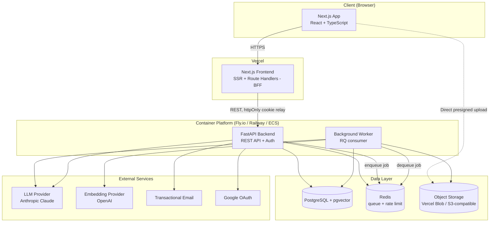
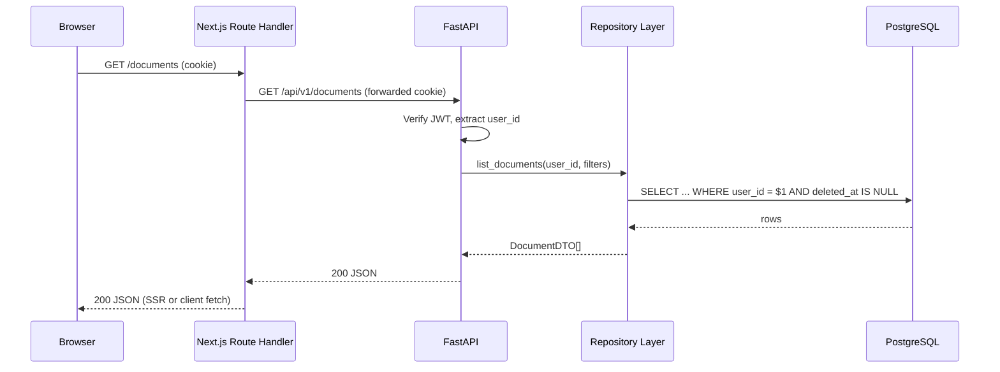
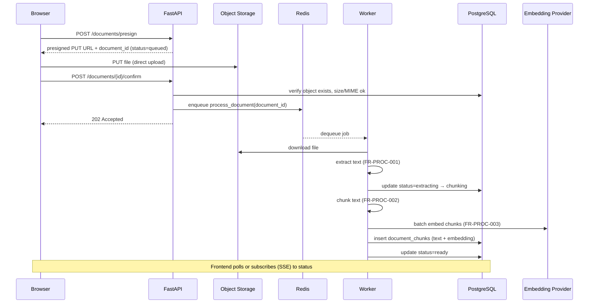
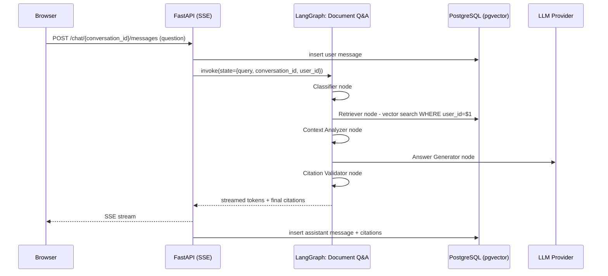

# Doxly — System Architecture

> Defines the high-level system topology, service boundaries, and data/request flows. Complements `decisions.md` (why) and `database.md`/`api.md` (detailed contracts). Requirement references use IDs from `requirements.md`.

## 1. High-Level Architecture

Doxly is a two-service application plus supporting infrastructure, split per ADR-007 (`decisions.md`):

**Why this shape:** Next.js never talks to Postgres, Redis, or the LLM directly — it is a presentation + BFF layer that proxies authenticated calls to FastAPI. FastAPI is the single authorization boundary (`NFR-SEC-001`). Long-running work (document processing, multi-node LangGraph runs) is enqueued to the Worker, not executed inline in an API request, per ADR-008.

## 2. Service Responsibilities

### 2.1 Next.js Frontend (Vercel)
- Renders all pages (`ui-ux.md`).
- Route Handlers act as a thin BFF: forward requests to FastAPI with the user's cookies, set/refresh auth cookies returned by FastAPI, never hold business logic.
- Does not call Postgres, Redis, or LLM providers directly.

### 2.2 FastAPI Backend (Container)
- Owns authentication, authorization, and all synchronous CRUD (`api.md`).
- Enqueues long-running work (processing, AI workflows) to Redis and returns immediately with a job/status handle.
- Runs short/interactive AI calls inline where latency allows and streaming is needed (e.g., chat token streaming) — see `ai.md` for which operations are sync vs. queued.
- Layered internally: API (routers) → Service → Repository → DB, plus an AI layer and a Document-Processing layer that services call into (`skills/backend.md`).

### 2.3 Background Worker (Container)
- Consumes the Redis queue: document processing pipeline (`document-processing.md`), embedding generation, and LangGraph workflows that don't require token-by-token streaming (summarization, extraction, comparison).
- Shares the same Python codebase/image family as the API (same service layer, invoked from a job entrypoint instead of an HTTP route) to avoid logic duplication.

### 2.4 PostgreSQL + pgvector
- Single system of record: relational data + vector embeddings in one transactional store (ADR-003). Schema detailed in `database.md`.

### 2.5 Redis
- Job queue (RQ) for the worker.
- Rate-limiting token buckets (`NFR-SEC-002`, `decisions.md` OQ-08).
- Short-lived caches (e.g., search result caching) where justified by `performance.md`.

### 2.6 Object Storage
- Raw uploaded files only. Extracted text and chunks live in Postgres. Presigned URLs for both upload and (time-limited) download.

## 3. Request Flow — Standard CRUD (e.g., list documents)

Every repository method takes `user_id` as a mandatory first argument and filters on it — this is the single enforcement point for `NFR-SEC-001`, backed by service-layer tests that assert cross-tenant access is impossible (`testing.md`).

## 4. Document Processing Flow (`FR-PROC-*`)

On any stage failure: `documents.status=failed`, `processing_error` set to a sanitized message, job not retried indefinitely (`NFR-AVAIL-002`: max 3 attempts with backoff, then terminal failure surfaced to the user, `FR-PROC-004`).

## 5. AI Request Flow — Document Q&A (`FR-AI-001`)

Full node-by-node design: `langgraph.md`. Retrieval mechanics: `rag.md`. This is the one workflow that streams token-by-token, so it runs inline in the API process (not the queued worker) with the LangGraph run itself still bounded by a timeout and step limit (`ai.md` §Failure Handling).

## 6. Multi-Tenancy Enforcement Points

Per `NFR-SEC-001`, isolation is enforced at three layers (defense in depth), not just one:

1. **Authentication layer:** `user_id` is derived only from the verified JWT, never from a client-supplied field.
2. **Repository layer:** every query touching tenant data includes `WHERE user_id = :user_id` (or a join that transitively enforces it, e.g., `document_chunks` joined through `documents.user_id`). This is the primary enforcement point and is covered by dedicated cross-tenant-access tests (`testing.md`).
3. **Database layer:** foreign keys with `ON DELETE CASCADE` from `users` ensure orphaned tenant data cannot outlive its owner; indexes are designed with `user_id` as a leading column specifically to make the isolation filter cheap, not optional (`database.md`).

## 7. Environments

| Environment | Frontend | Backend/Worker | DB | Notes |
|---|---|---|---|---|
| Local dev | `next dev` (or Docker) | Docker Compose | Dockerized Postgres+pgvector | See `devops.md` |
| Preview | Vercel Preview Deployments | Ephemeral or shared staging container | Shared staging DB (isolated schema/data per PR optional) | Per-PR frontend preview against staging API |
| Production | Vercel Production | Container platform, ≥2 API replicas + N worker replicas | Managed Postgres w/ pgvector | See `deployment.md` |

## 8. Cross-Cutting Concerns Map

| Concern | Where it's enforced | Spec |
|---|---|---|
| AuthN/AuthZ | FastAPI middleware + repository filters | `security.md`, ADR-010 |
| Input validation | Pydantic schemas at API boundary | `api.md`, `skills/backend.md` |
| Rate limiting | Redis token bucket middleware in FastAPI | `security.md` |
| Observability | Structured logging + request IDs across Next.js → FastAPI → Worker | `observability.md` |
| Background jobs | Redis + RQ, worker container | ADR-008 |
| Citations/grounding | LangGraph Citation Validator node | `langgraph.md`, `rag.md` |
