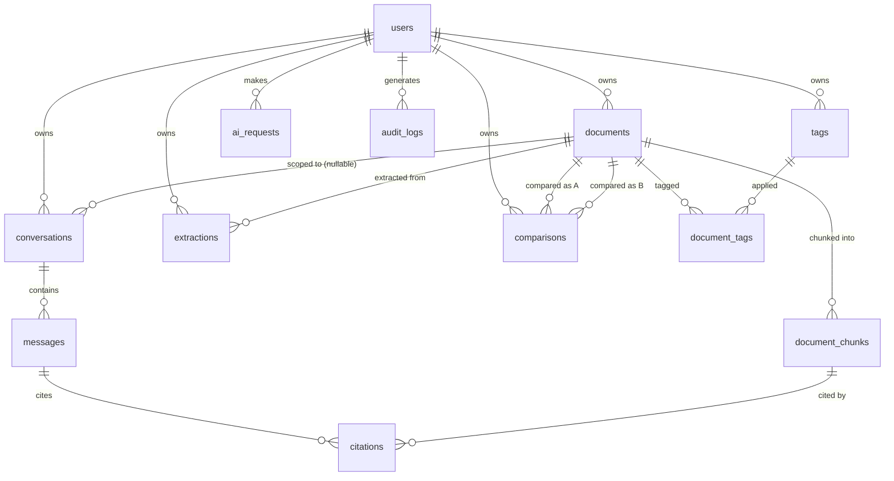

# Doxly — Database Specification

> PostgreSQL 14+ with the `pgvector` and `pgcrypto` (for `gen_random_uuid()`) extensions. SQLAlchemy 2.x models are the implementation of this spec; Alembic manages migrations. All tables use UUID primary keys unless noted. All tenant-scoped tables carry `user_id` per ADR-013.

## 1. Conventions

- **Primary keys:** `id UUID PRIMARY KEY DEFAULT gen_random_uuid()`.
- **Timestamps:** every table has `created_at TIMESTAMPTZ NOT NULL DEFAULT now()`; mutable tables also have `updated_at TIMESTAMPTZ NOT NULL DEFAULT now()` (updated via SQLAlchemy `onupdate`, not a DB trigger, to keep logic in the application layer).
- **Soft deletion:** tables representing user content (`documents`, `conversations`) use `deleted_at TIMESTAMPTZ NULL`; all read queries filter `WHERE deleted_at IS NULL` by default via the repository layer. Hard deletion is a separate background job (`privacy.md`).
- **Tenant isolation:** every tenant-owned table has `user_id UUID NOT NULL REFERENCES users(id) ON DELETE CASCADE`, indexed as the leading column of at least one index.
- **Naming:** snake_case, singular concept / plural table name (`documents`, not `document`).

## 2. Entity-Relationship Overview



## 3. Tables

### 3.1 `users`

**Purpose:** account identity, plan, and auth credentials.

| Column | Type | Constraints |
|---|---|---|
| id | UUID | PK |
| email | CITEXT | UNIQUE NOT NULL |
| password_hash | TEXT | NULL (null for OAuth-only accounts) |
| display_name | TEXT | NOT NULL |
| avatar_url | TEXT | NULL |
| oauth_provider | TEXT | NULL, CHECK IN ('google') |
| oauth_provider_id | TEXT | NULL |
| role | TEXT | NOT NULL DEFAULT 'user', CHECK IN ('user','admin') |
| plan | TEXT | NOT NULL DEFAULT 'free', CHECK IN ('free','pro') |
| storage_used_bytes | BIGINT | NOT NULL DEFAULT 0 |
| email_verified_at | TIMESTAMPTZ | NULL |
| status | TEXT | NOT NULL DEFAULT 'active', CHECK IN ('active','suspended','pending_deletion') |
| created_at / updated_at | TIMESTAMPTZ | see conventions |
| deleted_at | TIMESTAMPTZ | NULL (soft delete for `FR-USER-002`) |

**Indexes:** `UNIQUE (email)`; `(oauth_provider, oauth_provider_id)` unique where not null.
**Notes:** `storage_used_bytes` is a denormalized counter maintained transactionally on upload/delete to make quota checks (`FR-DOC-001`) O(1) instead of a SUM() scan.

### 3.2 `refresh_tokens`

**Purpose:** support session/device management (`FR-AUTH-008`) and revocation.

| Column | Type | Constraints |
|---|---|---|
| id | UUID | PK |
| user_id | UUID | FK → users, NOT NULL |
| token_hash | TEXT | UNIQUE NOT NULL (never store raw token) |
| device_label | TEXT | NULL |
| ip_address | INET | NULL |
| expires_at | TIMESTAMPTZ | NOT NULL |
| revoked_at | TIMESTAMPTZ | NULL |
| created_at | TIMESTAMPTZ | |

**Indexes:** `(user_id)`, `(token_hash)`.

### 3.3 `documents`

**Purpose:** uploaded file metadata + processing state. Central entity most other tables reference.

| Column | Type | Constraints |
|---|---|---|
| id | UUID | PK |
| user_id | UUID | FK → users, NOT NULL |
| file_name | TEXT | NOT NULL (user-facing display name, `FR-DOC-004`) |
| storage_key | TEXT | UNIQUE NOT NULL (generated, non-guessable — `NFR-SEC-004`) |
| mime_type | TEXT | NOT NULL, CHECK IN ('application/pdf','application/vnd.openxmlformats-officedocument.wordprocessingml.document','text/plain','text/csv') |
| size_bytes | BIGINT | NOT NULL |
| checksum_sha256 | TEXT | NOT NULL |
| page_count | INTEGER | NULL |
| status | TEXT | NOT NULL DEFAULT 'queued', CHECK IN ('queued','extracting','chunking','embedding','ready','failed') |
| processing_error | TEXT | NULL (sanitized, user-safe message only) |
| extracted_text_available | BOOLEAN | NOT NULL DEFAULT false |
| search_vector | TSVECTOR | `GENERATED ALWAYS AS (to_tsvector('english', file_name)) STORED` — filename matches for Global Search (`FR-SEARCH-*`, `rag.md` §Hybrid Search) |
| created_at / updated_at | TIMESTAMPTZ | |
| deleted_at | TIMESTAMPTZ | NULL |

**Indexes:** `(user_id, deleted_at)`, `(user_id, status)`, `(user_id, created_at DESC)` for list/sort; GIN index on `search_vector` (`ix_documents_search_vector`).
**Constraints:** `size_bytes` application-checked against plan-tier limit before insert (not a DB constraint, since limits vary by plan — see `decisions.md` OQ-06/07).

### 3.4 `document_chunks`

**Purpose:** retrieval unit for RAG — chunked text + embedding vector.

| Column | Type | Constraints |
|---|---|---|
| id | UUID | PK |
| document_id | UUID | FK → documents ON DELETE CASCADE, NOT NULL |
| user_id | UUID | FK → users, NOT NULL (denormalized from `documents.user_id` — see note) |
| chunk_index | INTEGER | NOT NULL |
| content | TEXT | NOT NULL |
| page_number | INTEGER | NULL |
| char_start | INTEGER | NULL |
| char_end | INTEGER | NULL |
| token_count | INTEGER | NOT NULL |
| embedding | VECTOR(1536) | NULL until embedded (see `rag.md` for dimension rationale) |
| embedding_model | TEXT | NOT NULL DEFAULT 'text-embedding-3-small' |
| search_vector | TSVECTOR | `GENERATED ALWAYS AS (to_tsvector('english', content)) STORED` — chunk-level full-text matches for Global Search (`FR-SEARCH-*`, `rag.md` §Hybrid Search) |
| created_at | TIMESTAMPTZ | |

**Indexes:**
- `UNIQUE (document_id, chunk_index)`
- `(user_id)` — leading column so tenant-filtered vector search doesn't require a join for the common case.
- Vector index: `CREATE INDEX ON document_chunks USING hnsw (embedding vector_cosine_ops)` (HNSW chosen over IVFFlat for better recall without a separate training/list-count tuning step at our expected scale — see `performance.md`).
- GIN index on `search_vector` (`ix_document_chunks_search_vector`), named consistently with the HNSW vector index above (R8, `tasks/remediation-plan.md` §11.1).

**Note on denormalized `user_id`:** stored redundantly (also derivable via `document_id → documents.user_id`) specifically so the pgvector similarity query can filter `WHERE user_id = :user_id` directly in the same index-friendly predicate without a join, which matters for `NFR-PERF-005`. Kept in sync via the same transaction that inserts the chunk; never updated independently.

### 3.5 `tags`

| Column | Type | Constraints |
|---|---|---|
| id | UUID | PK |
| user_id | UUID | FK → users, NOT NULL |
| name | TEXT | NOT NULL |
| color | TEXT | NULL |
| created_at | TIMESTAMPTZ | |

**Indexes:** `UNIQUE (user_id, name)`.

### 3.6 `document_tags` (join table)

| Column | Type | Constraints |
|---|---|---|
| document_id | UUID | FK → documents ON DELETE CASCADE |
| tag_id | UUID | FK → tags ON DELETE CASCADE |

**PK:** `(document_id, tag_id)`.

### 3.7 `conversations`

**Purpose:** a chat thread, optionally scoped to one document or a set of documents (`FR-AI-001`, `FR-AI-002`).

| Column | Type | Constraints |
|---|---|---|
| id | UUID | PK |
| user_id | UUID | FK → users, NOT NULL |
| title | TEXT | NULL (auto-generated from first message) |
| scope_type | TEXT | NOT NULL, CHECK IN ('single_document','multi_document','workspace') |
| created_at / updated_at | TIMESTAMPTZ | |
| deleted_at | TIMESTAMPTZ | NULL |

**Indexes:** `(user_id, deleted_at)`, `(user_id, updated_at DESC)`.

### 3.8 `conversation_documents` (join table)

**Purpose:** which document(s) a conversation is scoped to (supports both single- and multi-document chat without two schemas).

| Column | Type | Constraints |
|---|---|---|
| conversation_id | UUID | FK → conversations ON DELETE CASCADE |
| document_id | UUID | FK → documents ON DELETE CASCADE |

**PK:** `(conversation_id, document_id)`.

### 3.9 `messages`

| Column | Type | Constraints |
|---|---|---|
| id | UUID | PK |
| conversation_id | UUID | FK → conversations ON DELETE CASCADE, NOT NULL |
| user_id | UUID | FK → users, NOT NULL (denormalized for direct tenant filtering) |
| role | TEXT | NOT NULL, CHECK IN ('user','assistant','system') |
| content | TEXT | NOT NULL |
| token_count | INTEGER | NULL |
| status | TEXT | NOT NULL DEFAULT 'complete', CHECK IN ('complete','stopped','incomplete') |
| created_at | TIMESTAMPTZ | |

**Indexes:** `(conversation_id, created_at)`.

`status` — added at R4 (`tasks/remediation-plan.md`) implementation time: `api.md`'s `POST .../messages/{id}/stop` ("persisted... marked `status='stopped'`") and the chat SSE `error` event ("partial assistant output... persisted, flagged incomplete") both require distinguishing a normally-completed assistant turn from one that was user-stopped or cut short by a mid-stream failure — a distinction this table didn't yet have a column for. `'complete'` is the default for every message (user messages included, for schema uniformity; only assistant messages ever take the other two values in practice).

### 3.10 `citations`

**Purpose:** grounding record linking an assistant message to the chunk(s) it drew on (`FR-RAG-002`).

| Column | Type | Constraints |
|---|---|---|
| id | UUID | PK |
| message_id | UUID | FK → messages ON DELETE CASCADE, NOT NULL |
| document_chunk_id | UUID | FK → document_chunks ON DELETE SET NULL, NULL |
| document_id | UUID | FK → documents, NOT NULL |
| page_number | INTEGER | NULL |
| snippet | TEXT | NOT NULL |
| relevance_score | FLOAT | NULL |

**Indexes:** `(message_id)`.

### 3.11 `extractions`

**Purpose:** result of a structured extraction run (`FR-EXT-*`).

| Column | Type | Constraints |
|---|---|---|
| id | UUID | PK |
| user_id | UUID | FK → users, NOT NULL |
| document_id | UUID | FK → documents ON DELETE CASCADE, NOT NULL |
| template_key | TEXT | NULL (e.g., 'invoice', 'contract'; null if custom schema) |
| schema_json | JSONB | NOT NULL (the field schema used) |
| result_json | JSONB | NOT NULL (extracted values + per-field confidence + citation refs) |
| status | TEXT | NOT NULL DEFAULT 'completed', CHECK IN ('processing','completed','failed') |
| created_at | TIMESTAMPTZ | |

**Indexes:** `(user_id, document_id)`, `(user_id, created_at DESC)`.

### 3.12 `comparisons`

**Purpose:** result of comparing two documents (`FR-COMP-*`).

| Column | Type | Constraints |
|---|---|---|
| id | UUID | PK |
| user_id | UUID | FK → users, NOT NULL |
| document_a_id | UUID | FK → documents, NOT NULL |
| document_b_id | UUID | FK → documents, NOT NULL |
| status | TEXT | NOT NULL DEFAULT 'completed', CHECK IN ('processing','completed','failed') |
| result_json | JSONB | NOT NULL (structured diff: additions/deletions/modifications, classified) |
| created_at | TIMESTAMPTZ | |

**Indexes:** `(user_id, created_at DESC)`, `(document_a_id)`, `(document_b_id)`.
**Constraint:** `CHECK (document_a_id <> document_b_id)`.

### 3.13 `ai_requests`

**Purpose:** observability + cost/rate-limit accounting for every LLM/embedding call (`NFR-OBS-001`). **Never stores prompt/response content** — see `observability.md`.

| Column | Type | Constraints |
|---|---|---|
| id | UUID | PK |
| user_id | UUID | FK → users, NOT NULL |
| operation | TEXT | NOT NULL, CHECK IN ('chat','summarization','extraction','comparison','embedding') |
| provider | TEXT | NOT NULL |
| model | TEXT | NOT NULL |
| input_tokens | INTEGER | NULL |
| output_tokens | INTEGER | NULL |
| latency_ms | INTEGER | NULL |
| status | TEXT | NOT NULL, CHECK IN ('success','error','timeout') |
| error_code | TEXT | NULL |
| created_at | TIMESTAMPTZ | |

**Indexes:** `(user_id, created_at DESC)` (usage dashboard, rate limiting), `(created_at)` (admin aggregate views).

### 3.14 `audit_logs`

**Purpose:** security-relevant event trail (`security.md`) — logins, password changes, deletions, admin actions.

| Column | Type | Constraints |
|---|---|---|
| id | UUID | PK |
| user_id | UUID | FK → users ON DELETE SET NULL, NULL (actor; null if system) |
| target_user_id | UUID | FK → users ON DELETE SET NULL, NULL (subject, for admin actions) |
| action | TEXT | NOT NULL (e.g., 'login_success','login_failed','password_reset','document_deleted','account_deleted','admin_suspend_user') |
| ip_address | INET | NULL |
| metadata_json | JSONB | NULL (structured, non-sensitive context only) |
| created_at | TIMESTAMPTZ | |

**Indexes:** `(user_id, created_at DESC)`, `(action, created_at DESC)`.
**Retention:** append-only; retained per `privacy.md` (not deleted with the user's other content immediately — audit trail for security incidents persists per compliance defaults, then purged on a longer cycle).

## 4. pgvector Usage

- **Extension:** `CREATE EXTENSION IF NOT EXISTS vector;`
- **Column:** `document_chunks.embedding VECTOR(1536)` (dimension per `decisions.md` ADR-012/OQ-03 default — OpenAI `text-embedding-3-small`). The dimension is an implementation parameter, not hardcoded product logic: if the embedding provider changes, this requires a migration (new column or table) plus a backfill job, documented as a runbook in `rag.md`, not a silent schema assumption.
- **Index:** HNSW with cosine distance (`vector_cosine_ops`), matching the normalized-embedding assumption of the chosen provider.
- **Query pattern:**
  ```sql
  SELECT id, content, document_id, page_number,
         1 - (embedding <=> :query_embedding) AS similarity
  FROM document_chunks
  WHERE user_id = :user_id
    AND (:document_id_filter IS NULL OR document_id = :document_id_filter)
  ORDER BY embedding <=> :query_embedding
  LIMIT :k;
  ```
- **Multi-tenancy note:** the `user_id` predicate is always present and always the first filter — this is the DB-layer half of the defense-in-depth described in `architecture.md` §6.

## 5. Migrations (Alembic)

- One migration per logical schema change; migrations are never edited after being merged/deployed (a new migration corrects a prior one).
- `pgvector` extension creation and the HNSW index are part of the initial migration, not left implicit.
- Destructive migrations (column/table drops) require a documented rollback note in the migration file docstring.

## 6. Traceability

| Requirement | Tables |
|---|---|
| FR-AUTH-* | users, refresh_tokens |
| FR-DOC-*, FR-PROC-* | documents, document_chunks |
| FR-RAG-* | document_chunks (embedding + index) |
| FR-AI-* | conversations, conversation_documents, messages, citations |
| FR-SUM-* | (summaries persisted as a `messages`-like or dedicated row — see `ai.md` for whether summaries live in `extractions`-style table or their own; MVP: stored in a `document_summaries` table, structurally identical to `extractions` but summary-specific — see Open Item below) |
| FR-EXT-* | extractions |
| FR-COMP-* | comparisons |
| FR-SEARCH-* | document_chunks (vector) + `documents.file_name`/tags (full-text via `tsvector` generated column, see `rag.md` §Hybrid Search) |
| FR-ANALYTICS-* | ai_requests, documents, aggregated at query time (no separate analytics table for MVP — avoid premature aggregation infrastructure) |
| FR-ADMIN-* | users, audit_logs, ai_requests (aggregate) |

**Open item:** `document_summaries` table (id, user_id, document_id, summary_type, content, created_at) is implied by `FR-SUM-001`/`FR-SUM-002` but was not in the brief's minimum table list. It is added here as a necessary, minimal addition (same shape/isolation pattern as `extractions`) rather than overloading `extractions` with a different JSON shape — flagged for confirmation alongside the other schema decisions, not a silent scope change to product behavior.
