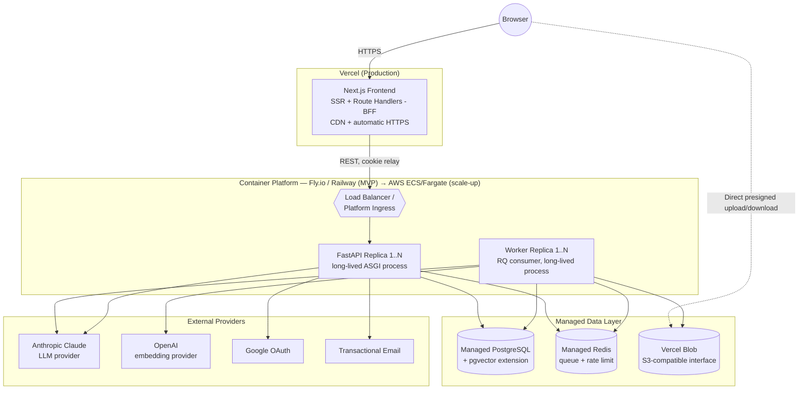

# Doxly — Deployment Architecture

> Defines how Doxly is deployed to production. Complements `decisions.md` (ADR-007: the Vercel/container split; ADR-009: presigned uploads) and `architecture.md` (service topology, environments table). `devops.md` owns local dev tooling and the CI build/test pipeline; this file owns **production topology and runtime configuration** — cross-referenced, not duplicated.

## 1. Topology recap

Per ADR-007: **Next.js frontend → Vercel. FastAPI backend + background worker → long-running containers on a container platform** (default recommendation: Fly.io or Railway for early stage; AWS ECS/Fargate as the scale-up path). This is not a stylistic choice — it is required by the execution-time and process-durability constraints of Vercel serverless functions, detailed in §12 below.

**Reading this diagram:** Vercel hosts exactly one thing — the Next.js frontend. Everything that holds a database connection, consumes a queue, or calls an AI provider for more than a token-stream lives on the container platform or as managed infrastructure outside Vercel entirely. This mirrors `architecture.md` §1's request-flow diagram, redrawn here for *where things run* rather than *how a request flows*.

## 2. Next.js deployment (Vercel)

- **Deploy trigger:** push to `main` → production deploy; every open PR → an isolated preview deploy (per `architecture.md`'s Environments table), both via Vercel's native Git integration — no custom deploy scripting needed for the frontend.
- **Static assets & CDN:** built assets (JS bundles, images, fonts) are served from Vercel's Edge Network automatically; no separate CDN configuration required.
- **Environment variables:** configured per-scope in the Vercel dashboard (Production / Preview / Development), never committed to the repo. Two classes:
  - `NEXT_PUBLIC_*` prefixed — bundled into client-side JavaScript, visible to anyone. Only non-secret values belong here (e.g., `NEXT_PUBLIC_API_BASE_URL` for the FastAPI origin used by client-side fetches, if any occur outside route handlers).
  - Unprefixed — server-only, available in Route Handlers and Server Components, never sent to the browser. Anything remotely sensitive (backend service tokens, internal URLs) must be unprefixed.
  - **Rule:** a secret must never be assigned to a `NEXT_PUBLIC_*` variable. This is a code-review gate, not just a convention.
- **Execution limits:** Vercel serverless (and Edge) functions have hard execution-time ceilings (commonly in the 10–60 second range depending on plan/runtime) and no durable background-process model — a function either returns within its window or is killed. This is why Next.js Route Handlers exist purely as a thin BFF: forward the request to FastAPI, relay the response/cookies, nothing else. No document parsing, no LLM chains, no polling loops live inside a Vercel function.

## 3. FastAPI backend deployment (container platform)

- **Build:** a container image is built in CI (see `devops.md`) and pushed to a registry; the platform deploys the image, not source code directly.
- **Scaling:** minimum 2 replicas in production for availability (`NFR-SCALE-001`), fronted by the platform's load balancer.
- **Health checks:** a lightweight `/health` endpoint (DB connectivity + basic liveness, no auth required, no sensitive data returned) is polled by the platform's orchestrator to route traffic only to ready replicas and restart unhealthy ones.
- **Graceful shutdown:** on deploy/restart, a replica stops accepting new connections but finishes in-flight requests (bounded grace period) before terminating, so a rolling deploy never drops an active chat stream mid-response.

## 4. Background worker deployment

- **Separate deployable** from the API, with its own replica count (`NFR-SCALE-002`) — request volume and processing volume do not correlate, so coupling their scaling would be wasteful in one direction and starved in the other.
- **Scaling heuristic:** for MVP, worker replica count is set manually based on observed queue depth/backlog; a documented future enhancement is autoscaling workers when the Redis queue depth (per ADR-008) exceeds a threshold for a sustained period.
- **Why it isn't on Vercel:** a worker process is designed to run for as long as a job takes — a 50-page PDF pipeline or a multi-node LangGraph extraction run can take well beyond any serverless execution ceiling. Running it as a long-lived container process (not a request/response cycle) is the entire point of ADR-008/ADR-007; it has no timeout ceiling imposed by the platform, only the application-level job timeout defined in `ai.md`/`langgraph.md`.

## 5. Environment variables in production

The full variable inventory is §5.1 below; `devops.md` covers how these are supplied in CI and local `.env` files. In production specifically:
- All backend/worker secrets are injected by the container platform's secret store, never baked into the image.
- Distinct values per environment (dev/preview/prod) — a leaked preview key must not grant access to production data or a shared production LLM budget.
- The Next.js side only ever needs the public API base URL and any `NEXT_PUBLIC_*` display-only flags — it holds no provider or database credentials at all, by design (it never talks to them directly, per `architecture.md` §1).

### 5.1 Environment variable inventory

Names and purpose only — no real values are recorded in any spec file. Actual values live in Vercel's env store (frontend) and the container platform's secret store (backend/worker), per-environment (`devops.md` covers how these are set in CI).

| Variable | Where it lives | Purpose |
|---|---|---|
| `NEXT_PUBLIC_API_BASE_URL` | Frontend / Vercel | Public FastAPI origin the browser/client bundle calls directly (e.g., for SSE) |
| `NEXT_PUBLIC_*` (display-only flags) | Frontend / Vercel | Any other non-secret, browser-visible config (e.g., feature flags safe to expose) |
| `INTERNAL_API_URL` | Frontend / Vercel (server-only, unprefixed) | Origin the Next.js Route Handler (BFF) calls server-side; may differ from the public URL |
| `DATABASE_URL` | Backend + Worker | Managed PostgreSQL connection string (SSL required, §6) |
| `REDIS_URL` | Backend + Worker | Managed Redis connection (job queue + rate-limit store, ADR-008) |
| `JWT_SIGNING_KEY` | Backend | Secret used to sign/verify access + refresh JWTs (ADR-010) |
| `ANTHROPIC_API_KEY` | Backend + Worker | LLM provider credential (ADR-011) |
| `OPENAI_API_KEY` | Backend + Worker | Embedding provider credential (ADR-012) |
| `STORAGE_PROVIDER` | Backend + Worker | Which `StorageProvider` implementation to load (`blob`, `s3`, `r2`, …) |
| `STORAGE_ACCESS_TOKEN` / `STORAGE_ACCESS_KEY_ID` + `STORAGE_SECRET_ACCESS_KEY` | Backend + Worker | Credentials for the configured storage provider (shape depends on provider) |
| `GOOGLE_OAUTH_CLIENT_ID` / `GOOGLE_OAUTH_CLIENT_SECRET` | Backend | Google OAuth2 app credentials (ADR-010, OQ-01) |
| `CORS_ALLOWED_ORIGINS` | Backend | Comma-separated list of origins permitted to call the API (§11) |
| `EMAIL_PROVIDER_API_KEY` | Backend | Transactional email provider credential (verification, password reset) |
| `LOG_LEVEL` | Backend + Worker | Per-environment log verbosity (§9) |

## 6. PostgreSQL connection

- **Managed Postgres with pgvector enabled.** This is a hosting requirement to verify explicitly when selecting a provider — not every managed Postgres offering ships the `pgvector` extension enabled by default. Candidate providers (Neon, Supabase, Railway Postgres, or AWS RDS for PostgreSQL with the extension explicitly enabled) each support `pgvector`, but availability, version, and index type support (HNSW requires a sufficiently recent `pgvector` version — `database.md` §4) must be confirmed for the specific provider and plan tier chosen before committing. This is flagged as an infra choice to confirm at implementation time, not silently assumed, consistent with `decisions.md`'s open-question pattern.
- **Connection pooling:** both the API (≥2 replicas, many short-lived request-scoped connections) and the worker (N replicas, fewer but longer-lived job connections) hold DB connections concurrently. For MVP replica counts this is unlikely to exhaust Postgres's default connection limit, but PgBouncer (or the managed provider's built-in pooler, e.g., Neon's or Supabase's pooled connection string) is the documented scaling step once replica count grows — flagged as a scaling concern, not an MVP blocker.
- **SSL required** for all production database connections; no unencrypted connections accepted.

## 7. File storage in production

- Vercel Blob is the default production object store (`decisions.md` OQ-04), configured with production-scoped credentials.
- **Presigned URL generation happens in FastAPI**, not Next.js — FastAPI is the sole authorization authority (ADR-010) and is what decides whether a given user may create a new upload slot (quota check, plan check). The Next.js route handler that the browser calls is a pass-through proxy to that FastAPI endpoint.
- **The actual file bytes never transit Vercel or FastAPI**: the browser uploads directly to Blob storage using the presigned URL (see `architecture.md`'s Document Processing Flow sequence diagram), which is what keeps large uploads compatible with Vercel's body-size limits (§12) and off the FastAPI request path entirely.
- **Provider is a config change, not a code change:** because storage is accessed exclusively behind the `StorageProvider` interface (`decisions.md` ADR-009), moving from Vercel Blob to S3 or Cloudflare R2 later (e.g., for cheaper egress at scale, OQ-04) means implementing/enabling a new `StorageProvider` and flipping the `STORAGE_PROVIDER` environment variable — no changes to the document-processing pipeline, API routes, or business logic that call the interface.

## 8. AI provider configuration

- LLM and embedding provider API keys are backend/worker secrets exclusively — the frontend never holds or calls these directly, eliminating any path for a provider key to leak into a client bundle (`NFR-SEC-008`, `requirements.md`).
- **Per-environment keys:** where the provider supports scoped/separate API keys (both Anthropic and OpenAI do), production, preview, and local dev each use distinct keys. This isolates cost/quota accounting per environment and, more importantly, means a bug in a preview deployment (e.g., an infinite LangGraph retry loop) cannot burn production spend or trip a production rate/quota alert.
- **Recommended safety net beyond app-level limits:** configure a monthly spend cap / budget alert at the provider account level (Anthropic/OpenAI account settings) in addition to the application's own rate limiting (`decisions.md` OQ-08). App-level limits protect against a single account's runaway usage; the provider-level cap protects against a systemic bug or attack pattern the app-level limiter didn't anticipate.

## 9. Build configuration

- **Next.js:** standard Vercel-managed Next.js build output (SSR + Route Handlers) — no static export mode, since the app relies on server-rendered/dynamic routes and API proxying.
- **FastAPI:** the production container runs multiple ASGI worker processes behind the platform's ingress (the standard Uvicorn-workers-behind-a-process-manager pattern, or an equivalent multi-worker ASGI runner) — the exact process count is a per-environment tuning parameter, not a fixed spec value.
- **Configuration source:** all environment-specific values come from injected environment variables; no environment-specific config files are committed to the repository.

## 10. Production configuration — what differs by environment

Beyond the environment-variable *values* already covered in §5, the following behavioral settings are intentionally different per environment (local / preview / production, per `architecture.md` §7), not just different secrets:

| Setting | Local | Preview | Production |
|---|---|---|---|
| Log verbosity (`LOG_LEVEL`) | `debug` | `info` (or `debug` for active investigation) | `info`/`warning` — verbose enough for `observability.md` needs, not so verbose it's costly/noisy at volume |
| Rate limiting (`decisions.md` OQ-08) | Relaxed/disabled for fast local iteration | Same policy as production (catches limiter bugs before release) | Full policy enforced |
| AI model tier | Cheapest available model regardless of quality, to keep iteration cheap | Cheaper/faster model tier by default (e.g., Haiku-class over Sonnet-class) to bound preview AI spend, unless a PR specifically needs production-quality output to review | Production-configured model tier per `ai.md`'s model-selection table (ADR-011/012, OQ-02/03) |
| CORS allowed origins | `localhost` dev ports | Preview deployment's Vercel-generated domain pattern | Locked to the exact production frontend domain(s) only — no wildcards (§11) |
| AI provider API keys | Local/dev key (own quota) | Preview key (own quota, §8) | Production key (own quota, §8) |

**Why this matters:** without an explicit per-environment model-tier and rate-limit policy, it is easy to accidentally run preview traffic against production-cost models and production-strictness limits (wasteful) or, worse, run production against preview-relaxed limits (a security/cost gap). This table exists so that distinction is a deliberate configuration choice, not an accident of whatever the last environment variable set happened to be.

## 11. Production hardening

- **CORS:** FastAPI's CORS policy allows only the known production Vercel domain(s) (and preview-deployment domains via a pattern match scoped to the project, if preview environments call a shared staging API) — never a wildcard origin in production.
- **HTTPS-only** end to end: Vercel terminates TLS for the frontend by default; the container platform's ingress must terminate TLS (or sit behind one that does) for the backend, with HTTP-to-HTTPS redirect enforced.
- **Security headers:** the specific header list (CSP, HSTS, X-Content-Type-Options, frame-ancestors) is owned by `security.md` (`NFR-SEC-011`) — applied at the FastAPI response layer and/or Vercel edge config; not redefined here.

## 12. Vercel limitations — why the split exists (explicit, central statement)

This section exists because the initialization brief explicitly warns against assuming long-running processing can execute synchronously in a serverless request. The concrete limitations that drove ADR-007:

1. **Execution time limits.** Vercel serverless/Edge functions terminate after a fixed window; document parsing, embedding generation, and multi-node LangGraph runs routinely exceed it for non-trivial documents.
2. **No durable background-worker primitive.** Vercel has no first-class mechanism for a process that outlives a single invocation and consumes a queue — which is exactly the execution model document processing and background AI workflows need.
3. **Request body size limits.** Proxying file uploads through a Vercel function is impractical past a small size ceiling — solved entirely by the direct-to-storage presigned upload pattern (§7), which means no uploaded file ever needs to fit inside a Vercel function's request body in the first place.
4. **Cold starts on what should be a persistent, DB-connected process.** A serverless invocation model adds cold-start latency to anything it hosts; that's a bearable inconvenience for a thin proxy, but the FastAPI/worker layer specifically wants a long-lived, warm process that holds a pooled DB connection (§6) and, for the worker, a standing Redis queue subscription — a model fundamentally at odds with per-invocation serverless execution, independent of the raw latency number.

**Resulting design rule:** *Vercel hosts presentation and quick proxying only. Anything that can take more than a few seconds, must survive longer than one HTTP request/response cycle, or wants a persistent connection to Postgres/Redis, runs in the container platform via the Redis job queue.* This is why "the app is deployed on Vercel" is only ever true of the frontend — a reader should not infer from that statement that the API, worker, database, or AI processing run there too.

## 13. Long-running AI processing & background processing — how the queue satisfies the constraint

Restating the mechanism from `decisions.md` ADR-008 and the sequence diagrams in `architecture.md` §4–5, specifically through the lens of the Vercel constraint above: any operation that cannot complete within a single fast HTTP round trip (document processing, summarization, extraction, comparison) is enqueued to Redis by a quick FastAPI call and executed by the container-hosted worker, which has no timeout ceiling beyond the application-level job timeout defined in `ai.md`/`langgraph.md`. The one exception is the Document Q&A chat workflow, which streams token-by-token inline from the FastAPI container (also not Vercel) over SSE — still outside Vercel's execution model, just synchronous rather than queued, because it needs to stream to the client rather than run fully in the background.

**Client-side UX implication (`FR-DOC-008`):** since the client cannot simply hold open one long-lived HTTP call to Vercel for a background job, the UI polls a status endpoint (or subscribes via SSE served from the FastAPI container) to reflect pipeline stage transitions (`queued → extracting → chunking → embedding → ready`) as they happen, rather than blocking on a single request until processing finishes.
