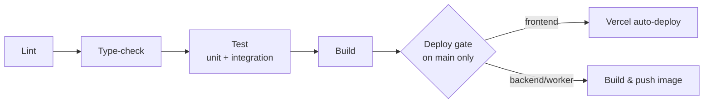

# Doxly — DevOps Specification

> Defines HOW the team builds, tests, and ships Doxly: local development via Docker Compose, Git branching/PR workflow, the CI pipeline, and the database migration workflow. This file owns process and local-environment mechanics. `deployment.md` owns WHERE things run in production (Vercel specifics, container platform choice, per-environment variable inventory, Vercel limitations) — refer there for production topology. `security.md` owns the deeper secrets-management requirements (NFR-SEC-008); this file covers the DevOps mechanics of how secrets are injected per environment. `database.md` §5 owns Alembic migration authoring conventions; this file covers the review/deploy workflow around them.

## 1. Docker Architecture

Per ADR-006 (`decisions.md`), every service runs in Docker, both locally and (for backend/worker) in production. Per `architecture.md` §2.3, FastAPI and the background worker share the same application image — same codebase, same dependency layer — differing only in the container's entrypoint command (HTTP server vs. queue consumer), so dependencies are built once, not duplicated across two images.

| Service | Base image family | Purpose | Key env vars | depends_on |
|---|---|---|---|---|
| `next-app` | Node LTS | Next.js frontend (dev only — production is Vercel, not this container; see `deployment.md`) | `NEXT_PUBLIC_API_URL`, `NEXTAUTH_*`/session-cookie config | `fastapi-app` |
| `fastapi-app` | Python (slim) | REST API, auth, synchronous CRUD, inline streaming AI calls | `DATABASE_URL`, `REDIS_URL`, `JWT_SECRET`, `LLM_PROVIDER_API_KEY`, `EMBEDDING_PROVIDER_API_KEY`, `STORAGE_*` | `postgres`, `redis` |
| `worker` | Python (slim) — same image as `fastapi-app`, different entrypoint | Consumes the RQ queue: document processing, embedding generation, non-streaming LangGraph workflows | same env vars as `fastapi-app` (shared config surface) | `postgres`, `redis` |
| `postgres` | Official `pgvector/pgvector` image (Postgres 14+ with the extension preinstalled) | System of record: relational data + embeddings (ADR-003) | `POSTGRES_USER`, `POSTGRES_PASSWORD`, `POSTGRES_DB` | — |
| `redis` | Official Redis image | RQ job queue, rate-limit token buckets (ADR-008) | — (no auth needed for local dev; production config in `deployment.md`) | — |

Using the `pgvector/pgvector` base image (rather than plain `postgres` + a manual extension install step) keeps the pgvector version pinned and identical across every developer's machine and CI, avoiding the classic "works on my machine" drift for a native-code extension.

## 2. Docker Compose (Local Development)

A single `docker-compose.yml` at the repo root composes all five services described above. Conceptually, it provides:

- **Hot-reload volumes** for `next-app` and `fastapi-app`: the host source tree is mounted into each container so `next dev` and FastAPI's auto-reloading dev server pick up file changes without an image rebuild. `worker` shares the same mounted source as `fastapi-app` since it's the same image.
- **A local Postgres with pgvector**, migrated automatically on startup (see §3) so a fresh clone reaches a working schema without a manual step, and optionally seeded with representative sample data (documents, a demo user) for UI development.
- **Redis**, unauthenticated locally, giving the worker and API something to enqueue/dequeue against immediately.
- **An `.env.example` pattern**: the repository commits `.env.example` with every variable the compose stack needs, each set to a placeholder or obviously-fake value — never a real secret. Each developer copies it to a gitignored `.env` and fills in their own (or a shared team dev-only) API keys. This mirrors the secrets principle in `security.md` (NFR-SEC-008): nothing that grants access ever lives in source control, even for "just local dev" convenience.
- **Service isolation with a shared network**: containers reach each other by service name (`fastapi-app` calls `postgres:5432`, not `localhost`), matching how the same code addresses managed services in production (`deployment.md`), which is the core value of ADR-006's dev/prod parity goal.

## 3. Development Environment Workflow

A new contributor gets a fully running stack through the following steps:

1. Clone the repository.
2. Copy `.env.example` to `.env` and fill in the required values — for local dev, most default to safe placeholders (DB credentials, JWT signing secret can be any local value); LLM and embedding provider API keys must be real (a shared team dev key or the contributor's own) since AI features call out to live providers even in local dev.
3. Bring up the full stack via the Compose entrypoint (a documented `make`/npm script wraps the underlying `docker compose up` invocation so contributors don't need to memorize flags).
4. On first startup, database migrations run automatically against the local Postgres container before the API becomes ready to serve traffic — a new contributor never has to run a manual migration command just to get to a working schema. The same startup step also seeds optional sample data (a demo user, a couple of processed documents) when a `SEED_DB` flag is set, useful for frontend/UI work without needing to upload real files.
5. The contributor confirms the stack is healthy by hitting the frontend and API health-check endpoints, then begins work with hot-reload active on both `next-app` and `fastapi-app`.
6. When the contributor pulls new changes that include an Alembic migration, restarting the stack (or re-running the migration step alone) brings their local schema up to date — migrations are idempotent and additive per `database.md` §5, so this is safe to run repeatedly.

No production credentials, staging database access, or real user data are ever part of this workflow — local dev is fully self-contained against the Dockerized Postgres/Redis instances.

## 4. Git Workflow

**Decision: GitHub Flow** — short-lived feature branches off `main`, opened as a pull request, merged back into `main` once approved and green.

- **Branching:** every change (feature, fix, chore) starts as a branch off `main`, named descriptively (e.g., `feat/document-comparison`, `fix/chunk-index-race`). Branches are expected to live hours-to-days, not weeks — long-lived branches accumulate merge conflicts and drift from the CI pipeline's assumptions.
- **Pull requests required:** direct pushes to `main` are not the normal path. Every change lands via a PR, which is where CI runs (§5) and review happens.
- **Review:** at least one approving review is required before merge. For a small early-stage team this is deliberately lightweight — one reviewer, not a multi-stage approval chain — chosen to keep velocity high while still catching correctness issues, tenant-isolation regressions (`architecture.md` §6), and spec drift before they reach `main`.
- **CI must pass:** the full pipeline (§5) must be green on the PR before merge is allowed.
- **Merge strategy:** squash-merge is preferred. Each feature branch's many small commits (WIP, fixups, review-response commits) collapse into one clean commit on `main`, keeping `main`'s history readable and making `git bisect`/rollback straightforward.

**Why GitHub Flow over trunk-based-with-feature-flags or Git Flow:** the team is small and early-stage, with a single deployable environment sequence per service (dev → preview → production, `architecture.md` §7) rather than multiple parallel release trains. Git Flow's `develop`/release-branch ceremony solves a coordination problem this team doesn't have yet; full trunk-based development with per-commit production deploys and feature flags is a heavier discipline than an early product needs. GitHub Flow's single long-lived branch plus ephemeral feature branches, backed by Vercel's automatic PR preview deployments (`architecture.md` §7, `deployment.md`), gives fast iteration with a real review gate.

## 5. CI Pipeline (GitHub Actions)

CI runs on every pull request (and again on merge to `main`, as the trigger for CD in §6). The pipeline is staged so that fast, cheap checks fail early before expensive ones run:

**Stages:**

1. **Lint:** frontend — ESLint + Prettier check (no auto-fix in CI, formatting violations fail the build); backend — `ruff` + `black --check`. Catches style and simple correctness issues before anything more expensive runs.
2. **Type-check:** frontend — `tsc --noEmit`; backend — `mypy` (or `pyright`) against the FastAPI/SQLAlchemy codebase. Enforces the "validate everything at the boundary" and typed-contract principles that `api.md`'s generated OpenAPI schema and `database.md`'s SQLAlchemy models depend on.
3. **Test (unit + integration):** the full automated test suite runs against ephemeral service dependencies (a fresh Postgres with pgvector and Redis spun up for the CI job, matching the local Compose stack). What the suite covers — unit tests, cross-tenant isolation tests, LangGraph node tests, API contract tests — is defined in `testing.md`; this pipeline stage is the trigger point, not the source of truth for coverage.
4. **Build:** frontend — `next build`, confirming the production bundle compiles cleanly; backend — the shared `fastapi-app`/`worker` image builds successfully. A build failure here blocks merge even if tests passed, catching build-time-only issues (env var access patterns, static generation errors).
5. **Deploy gate (main only):** the preceding four stages must all succeed. This stage does not run on PR branches — it is the hinge between CI and CD, described in §6.

**Explicitly out of scope for CI:** CI never applies migrations to a production or staging database, and never deploys anything itself. It only proves the code is lintable, type-safe, tested, and buildable, then hands off to CD. Migration application to production is an explicit, reviewed deploy step (§8, `deployment.md`), not something that happens as a side effect of a green CI run.

## 6. Continuous Deployment

CD is triggered automatically by CI success on `main` — never a manual "click to deploy" step, and never triggered from a feature branch.

- **Frontend:** Vercel's native GitHub integration deploys the `next-app` on every push to `main` that passes CI, using Vercel's own build pipeline (which independently re-runs `next build`). Preview deployments for open PRs are a separate, always-on Vercel behavior independent of this main-branch CD flow.
- **Backend/worker:** on merge to `main`, the shared application image (§1) is built and pushed to a container registry, then deployed to the container platform. The exact registry, deployment mechanism (rolling restart, blue/green), and platform (Fly.io/Railway/ECS) are production topology decisions owned by `deployment.md` — this file only establishes that the trigger is CI-success-on-main, not a manual action, and that both frontend and backend/worker deploy from the same merge event so they stay in lockstep.

## 7. Secrets & Environment Variables

**Principle:** secrets are never committed to source control. `.env` files are gitignored everywhere (local dev, CI runners, build agents); `.env.example` documents every required key by name with a placeholder or obviously-fake value only. The deeper secrets-management requirements — rotation, least-privilege scoping, what counts as a secret — are specified in `security.md` (NFR-SEC-008). This section covers only the DevOps mechanics of injection per environment:

| Environment | Where secrets live | How they reach the running process |
|---|---|---|
| Local dev | Developer's own `.env` (gitignored) | Read by Docker Compose and injected as container env vars |
| CI (GitHub Actions) | GitHub Actions encrypted repository/environment secrets | Injected into the workflow run as env vars for the job that needs them (e.g., a dev-tier LLM key for integration tests that exercise the provider abstraction) |
| Frontend production/preview | Vercel project environment variables (scoped per environment: Production/Preview/Development) | Vercel injects them at build and runtime automatically via its GitHub integration |
| Backend/worker production | Container platform's secret store | Injected as environment variables into the running container at deploy time; exact mechanism per platform is detailed in `deployment.md` |

No secret is ever baked into a built image or a committed config file — it is always supplied at runtime by the platform holding it for that environment.

## 8. Database Migrations Workflow

Migration **authoring conventions** (one migration per logical change, never edited after merge, `pgvector` extension + HNSW index created in the initial migration) are defined in `database.md` §5 and are not repeated here. This section defines the workflow around them:

1. **Written alongside the model change:** an Alembic migration is authored and committed in the same PR as the SQLAlchemy model change that requires it — never generated and applied ad hoc against a running database, and never as a separate follow-up PR that could land out of order with the code that depends on the new schema.
2. **Reviewed as part of the PR:** the migration file is part of the normal code review (§4) — reviewers check the migration is additive/backward-compatible where possible, and that any destructive change carries the rollback note required by `database.md` §5.
3. **Tested in CI against a fresh database:** the CI test stage (§5) runs migrations from scratch against the ephemeral CI Postgres before the test suite executes, proving the migration applies cleanly and the resulting schema matches what the tests (and the ORM models) expect. This also catches migrations that only work against a database that already has manually-applied state.
4. **Applied to production as an explicit, reviewed deploy step — not automatically:** unlike the frontend/backend image deploy (§6), migrations are not run as an unattended side effect of every merge to `main`. Applying a migration to the production database is a deliberate, logged action taken as part of the deploy process, giving a human the chance to sequence it correctly relative to the application deploy (e.g., additive-first for zero-downtime changes) and to intervene if it fails partway. The exact production migration execution mechanism (who/what runs `alembic upgrade head`, in which step of the deploy sequence) is specified in `deployment.md`.
5. **Never run directly against production outside this path:** no one applies a migration by hand against the production database outside the logged deploy step, even for "small" schema fixes — a corrective change is itself a new migration, following the same PR → review → CI → deploy path.

## 9. Traceability

| Concern | Spec |
|---|---|
| Docker service split rationale | `decisions.md` ADR-006, ADR-007, ADR-008 |
| Shared FastAPI/worker image | `architecture.md` §2.3 |
| Production deploy topology, Vercel specifics, per-environment variable inventory | `deployment.md` |
| Secrets-management requirements (NFR-SEC-008) | `security.md` |
| Migration authoring conventions, pgvector/HNSW setup | `database.md` §5 |
| Test suite composition and coverage | `testing.md` |
