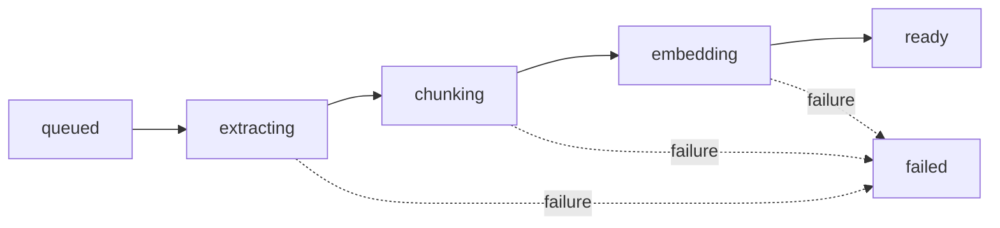
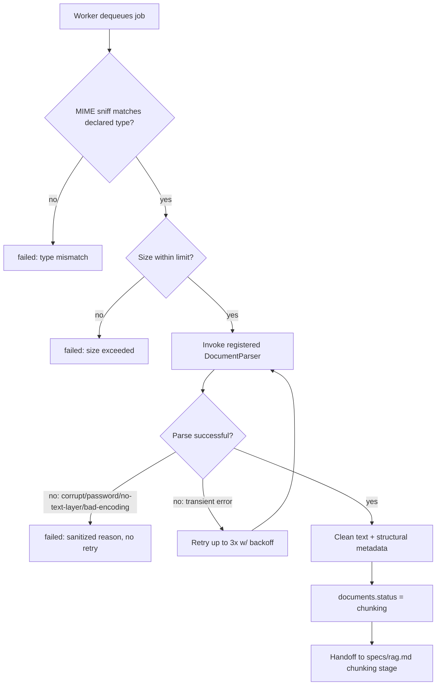

# Doxly — Document Processing Specification

> Defines how raw uploaded files (PDF, DOCX, TXT, CSV) become clean, structured, chunk-ready text. This file owns **file validation, per-type parsing, processing state transitions, error handling, and storage** for the document pipeline. Chunking algorithm mechanics, embeddings, and retrieval are owned by `specs/rag.md` — this file defines the exact input handoff to that stage (clean text + structural metadata). Orchestration/queueing is owned by `specs/architecture.md` §4 (Document Processing Flow). Requirement IDs reference `specs/requirements.md`.

## 1. Supported File Types & MIME Validation

| File type | Declared MIME type |
|---|---|
| PDF | `application/pdf` |
| DOCX | `application/vnd.openxmlformats-officedocument.wordprocessingml.document` |
| TXT | `text/plain` |
| CSV | `text/csv` |

**Validation rule (NFR-SEC-003, NFR-SEC-004):** the client-declared `Content-Type` and file extension are never trusted alone. The worker sniffs actual file content (magic bytes / structural signature — e.g., PDF's `%PDF-` header, DOCX's ZIP/OPC container signature) before invoking a parser. A mismatch between declared type and sniffed type causes immediate rejection with `documents.status=failed` and a generic `processing_error` ("File content does not match its declared type") — never a best-effort parse of a mismatched file. This is the server-side half of `FR-DOC-001`'s acceptance criteria; the client also performs an extension/MIME pre-check purely as UX (fast feedback), never as the security boundary.

Uploaded files are never served back to a browser with an executable or HTML content-type, and never executed server-side (NFR-SEC-003).

## 2. File Size Limits

- Default cap: **25 MB** per file (`decisions.md` OQ-06), configurable per plan tier in the future.
- **Client-side:** checked before the presigned upload request is even made, for fast feedback.
- **Server-side (authoritative):** after the direct-to-storage upload completes (`architecture.md` §4), the backend reads the actual stored object's size from the storage provider — not a client-supplied claim — before enqueuing processing. Oversized objects are rejected and the orphaned storage object is deleted immediately.

## 3. Per-Type Parsing Pipeline

### 3.1 PDF
- **Library:** `pypdf` for structure/metadata, `pdfplumber` as the primary text-extraction path (better layout fidelity for multi-column and tabular content).
- **Extraction:** page-by-page, preserving `page_number` for every unit of extracted text so downstream chunks can cite a page (`FR-RAG-002`).
- **Multi-column layouts:** best-effort left-to-right, top-to-bottom reading order via `pdfplumber`'s word-position clustering; not guaranteed perfect for complex academic/magazine layouts — documented as a known limitation, not silently "fixed."
- **Scanned/image-only PDF detection:** if a page yields zero extractable characters via the text layer across a sampled threshold of pages (e.g., first 3 pages and a random sample), the document is classified as **unsupported (no text layer)** rather than OCR'd (`decisions.md` OQ-05 — OCR is out of scope for MVP). Result: `documents.status=failed`, `processing_error="This document appears to be a scanned image without extractable text. OCR is not yet supported."` This is a distinct, user-legible outcome from a generic parsing failure.
- **Password-protected PDFs:** detected at open time; fails immediately with `processing_error="This document is password-protected and cannot be processed."` — never a retry loop against a permanent condition.

### 3.2 DOCX
- **Library:** `python-docx`.
- **Extraction:** paragraph-by-paragraph text, with heading styles (Heading 1/2/3 etc.) preserved as structural metadata where present, to help downstream chunking respect section boundaries.
- **Tables:** embedded tables are extracted as flattened text (row cells joined) inline with surrounding paragraph order; complex nested tables are extracted best-effort — not pixel/layout-perfect, documented as a known limitation.
- **No page numbers:** DOCX has no fixed pagination at the file-format level; `page_number` is left `NULL` for DOCX-derived chunks (matches `database.md`'s nullable `document_chunks.page_number`). Section/heading context is used as the citation anchor instead where available.

### 3.3 TXT
- **Extraction:** native Python decode. Encoding detection defaults to UTF-8; on decode failure, a fallback detection pass (e.g., via `charset-normalizer`) attempts common alternate encodings (Latin-1, UTF-16) before failing.
- **Structure:** line-based; paragraph boundaries inferred from blank-line separation for chunking purposes (handed to `rag.md`).
- **Failure mode:** if no encoding can decode the file into valid text, `processing_error="Unable to read this file's text encoding."`

### 3.4 CSV
- **Library:** `pandas` (preferred, for robust dialect/type inference on larger files) with the standard-library `csv` module as a lightweight fallback path for very small files.
- **Structure:** header row detected and preserved as column schema metadata; each row's cells are retained with their column names attached, since a CSV chunk is fundamentally different from a prose chunk.
- **Chunking handoff note:** unlike PDF/DOCX/TXT (paragraph/sentence-based chunking), CSV content is naturally chunked by **row groups** with the header repeated as context in each chunk, rather than character-count-based splitting. The exact grouping algorithm (rows-per-chunk, whether to co-locate related rows) is defined in `specs/rag.md` §Chunking Strategy — this file's responsibility ends at producing a clean, typed row/column structure for that stage to consume.
- **Failure mode:** malformed CSV (inconsistent column counts beyond a tolerance, unparseable dialect) → `processing_error="This file could not be parsed as valid CSV."`

## 4. Metadata Extracted (feeds `database.md`)

| Field | Populated by | Target column |
|---|---|---|
| Page count | PDF parser | `documents.page_count` |
| Per-unit page number | PDF parser | `document_chunks.page_number` |
| Heading/section context | DOCX parser | carried into chunk metadata as citation context (no dedicated column; embedded in `document_chunks.content` framing or a future metadata column — flagged as an open refinement, not a schema gap for MVP) |
| Column schema (CSV) | CSV parser | carried into chunk metadata similarly |
| Character offsets | all parsers | `document_chunks.char_start` / `char_end` |

`documents.extracted_text_available` is set `true` only once extraction fully succeeds for the whole document (not partially).

## 5. Processing States

Matches `database.md`'s `documents.status` enum exactly:

| State | Meaning | Triggered by |
|---|---|---|
| `queued` | Confirmed upload, job enqueued, not yet picked up | API, on upload confirmation (`architecture.md` §4) |
| `extracting` | Worker is running the per-type parser (§3) | Worker, job start |
| `chunking` | Text extracted successfully; worker is splitting into chunks (per `rag.md`) | Worker, after extraction succeeds |
| `embedding` | Chunks exist; worker is generating/storing embeddings (per `rag.md`) | Worker, after chunking succeeds |
| `ready` | Fully processed; available for chat/search/extraction/comparison | Worker, after all chunks embedded |
| `failed` | Any stage failed terminally | Worker, on unrecoverable error at any stage |

Status transitions are visible to the frontend via polling or SSE for `FR-DOC-008`.

## 6. Error Handling & Retry Policy

- **Sanitized errors only (NFR-SEC-009):** `processing_error` is always a short, user-safe string from a fixed set of known failure messages (examples given in §3). Library exceptions, stack traces, and internal file paths are logged internally (per `observability.md`) but never written to `processing_error` or returned to the client.
- **Retry policy (NFR-AVAIL-002):** transient failures (e.g., a momentary storage read error, embedding provider timeout) are retried up to **3 attempts** with exponential backoff by the job queue. Permanent/content-inherent failures (corrupt file, password-protected, no text layer, bad encoding, malformed CSV) are **not retried** — they fail immediately on first detection since retrying cannot change the outcome.
- **Manual reprocessing (`FR-PROC-005`):** a user can trigger reprocessing of a `failed` document (e.g., after re-uploading a fixed version, or if a transient cause is suspected), **or of a document stuck in a non-terminal stage** (`queued`/`extracting`/`chunking`/`embedding`) longer than the configured staleness threshold — recovery from a worker crash mid-job, since no exception is ever raised in that case for the normal retry path to act on (`decisions.md` ADR-026, `api.md`'s reprocess entry). This creates a fresh processing run from `queued`, does not silently reuse stale partial state (any prior `document_chunks` rows for that document are deleted before reprocessing begins, to avoid duplicate/orphaned chunks).

## 7. Storage

- **Raw file:** object storage only (`decisions.md` ADR-009), keyed by a generated non-guessable `storage_key` (UUID-based, never derived from the user's original filename — `NFR-SEC-004`). The original `file_name` is preserved purely as display metadata (`database.md documents.file_name`), never used to construct a storage path.
- **Extracted text & chunks:** Postgres only (`document_chunks.content`), never re-derived from the raw file at query time — extraction happens once per successful processing run.
- **No local disk persistence:** the worker downloads the raw file into ephemeral memory/temp storage for the duration of parsing only; nothing persists on the worker container's filesystem after the job completes.

## 8. Extensibility — Adding a New File Type

The pipeline is built around a `DocumentParser` interface, conceptually:

- A registry maps MIME type → parser implementation.
- Each parser implementation is responsible only for: (1) validating that sniffed content matches the claimed type, (2) producing extracted text plus structural metadata (page/section/row markers) in a common intermediate shape, and (3) raising a small, fixed set of typed parse errors (e.g., "unsupported content", "corrupt file", "password protected") that the orchestration layer maps to sanitized `processing_error` messages.
- The orchestration layer (worker job: extract → chunk → embed → ready, per `architecture.md` §4) never contains per-file-type branching logic itself — it looks up the registered parser for the document's validated MIME type and calls the same three-step interface regardless of type.

Adding support for a new type (e.g., PPTX, Markdown, HTML — Post-MVP candidates) requires implementing one new parser against this interface and registering its MIME type; no changes to upload validation flow, status machine, chunking handoff, or embedding stage are needed. This fulfills the requirement that new document types can be added without rewriting the system.

## 9. Parser Summary Table

| File type | Parser library | Extractable metadata | Known limitations |
|---|---|---|---|
| PDF | `pdfplumber` (+ `pypdf`) | Page count, per-page text, page numbers, best-effort reading order | Scanned/image-only PDFs unsupported (no OCR, OQ-05); complex multi-column/magazine layouts best-effort only |
| DOCX | `python-docx` | Paragraph text, heading levels, inline tables | No native page numbers; complex nested tables best-effort |
| TXT | Native Python decode + `charset-normalizer` fallback | Line/paragraph structure | Non-standard/binary-contaminated files may fail encoding detection |
| CSV | `pandas` (fallback: stdlib `csv`) | Header/column schema, typed rows | Highly irregular/malformed CSVs (inconsistent column counts) rejected rather than best-effort repaired |

## 10. Pipeline Flow

## 11. Traceability

| Requirement | Coverage |
|---|---|
| FR-DOC-001 | §1 (validation), §2 (size limits) |
| FR-PROC-001 | §3 (per-type extraction) |
| FR-PROC-002 | §4 (metadata handoff to chunking, owned in detail by `rag.md`) |
| FR-PROC-004 | §6 (failure handling) |
| FR-PROC-005 | §6 (manual reprocessing) |
| NFR-SEC-003, NFR-SEC-004 | §1, §7 |
| NFR-SEC-009 | §6 |
| NFR-AVAIL-002 | §6 |
