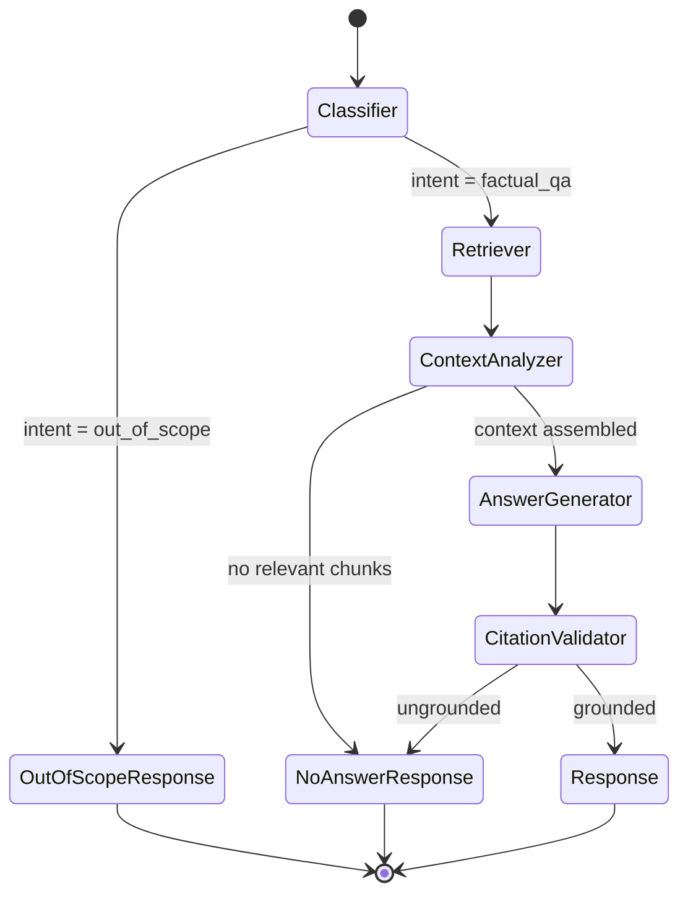
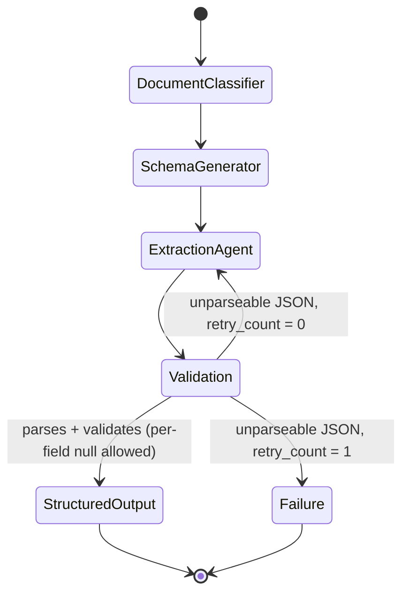

# Doxly — LangGraph Architecture

> Defines the four multi-step, stateful AI workflows implemented as LangGraph graphs, per `decisions.md` ADR-004. LangGraph is used here because these workflows have genuine branching, retries, and durable state — not for marketing value. Provider/model abstraction lives in `specs/ai.md` (referenced, not redefined here). Retrieval mechanics live in `specs/rag.md`. Document parsing lives in `specs/document-processing.md`. Prompt-injection defense lives in `specs/security.md`.

## 1. Shared Design Principles

### 1.1 State design
- Each graph defines a typed state object (a `TypedDict`/`pydantic.BaseModel`-shaped state in implementation) carrying only what downstream nodes need — no incidental data.
- Common fields across all four graphs: `user_id` (tenant scope, always present, never overwritten mid-graph), `request_id` (correlates to `ai_requests` rows per `observability.md`), `status` (mirrors the terminal states in `database.md`), `error` (populated on failure, sanitized per `NFR-SEC-009`).
- Workflow-specific fields (e.g., `retrieved_chunks` for Q&A, `schema_json` for Extraction) live only in that graph's state, not a shared "god object" state.

### 1.2 Node design
- Single responsibility per node; a node either calls the LLM, calls the DB/retriever, or validates — never more than one of these concerns per node, so each is independently unit-testable with the LLM mocked (`NFR-MAINT-002`).
- Nodes are idempotent where the underlying operation allows it (e.g., re-running the Retriever node with the same query and DB state yields the same chunks), which is what makes retries safe.
- Nodes never mutate `user_id` or narrow/widen tenant scope — this field is read-only after graph entry.

### 1.3 Routing / conditional edges
- Routing decisions are expressed as conditional edges keyed off a small set of state flags (e.g., `needs_retry: bool`, `validation_passed: bool`), not ad hoc branching buried inside a node.
- Every conditional edge has an explicit default/fallback branch — no routing decision is allowed to leave the graph without a matching edge.

### 1.4 Tool use within nodes
- Where a node needs to call out to a capability (vector retrieval, a calculator-style utility, a citation lookup), it does so via a declared tool the LLM can invoke (native tool-calling) or a direct function call from the node itself — whichever keeps the node's behavior deterministic and testable. Tools are the same underlying service-layer functions the REST API uses (`architecture.md` — no parallel implementation of retrieval logic).

### 1.5 Retry strategy
- Each node classifies failures as **transient** (provider timeout, rate limit, 5xx) or **permanent** (invalid input document, schema mismatch, content that cannot satisfy the request).
- Transient failures: retried with exponential backoff, max 3 attempts per node (consistent with `NFR-AVAIL-002`), then escalate to the graph's terminal failure state.
- Permanent failures: no retry — route directly to the terminal failure state with a sanitized reason.

### 1.6 Error handling & terminal states
- Every graph has exactly one success terminal state and one failure terminal state; no graph run is allowed to end in an ambiguous or missing state.
- Terminal states map 1:1 onto the `status` columns already defined in `database.md` (`documents.status`, `extractions.status`, `comparisons.status`) so the API/UI never needs graph-internal knowledge to render progress.
- On failure, the persisted error message is user-safe (no stack traces, no raw provider error bodies) per `NFR-SEC-009`.

### 1.7 Checkpointing
- Background-worker graphs (Summarization, Extraction, Comparison) use LangGraph's checkpointing to persist state after each node completes, keyed by the owning `document_id`/`extraction_id`/`comparison_id`. This allows a crashed worker to resume from the last completed node instead of restarting the whole graph (relevant for the retry policy in `decisions.md` ADR-008 and `NFR-AVAIL-002`).
- The inline Document Q&A graph (runs synchronously within an SSE-streaming API request) does not need cross-process resumability — its checkpoint scope, if used, is limited to enabling mid-run tracing, not resumption after a crash (a failed streaming request simply ends the SSE stream and the user retries).

### 1.8 Memory strategy
- Document Q&A's state includes a bounded conversation history window (prior turns from `messages`, trimmed per the token-budget rules in `specs/ai.md` §Context Management) so follow-up questions (`FR-AI-003`) have context without unbounded growth.
- Summarization, Extraction, and Comparison graphs are single-shot (no cross-turn memory) — each run is independent by design.

### 1.9 Human-in-the-loop (Post-MVP consideration)
- Not built in the initial phases. Documented as a future extension point: LangGraph supports interrupting a graph before a node (e.g., pausing the Extraction Agent when average field confidence is low, to let the user confirm/correct before finalizing). Flagged in `specs/roadmap.md` as Post-MVP, consistent with `FR-EXT-004` (manual correction is currently a post-hoc edit, not an in-graph pause).

---

## 2. Graph: Document Q&A

**Fulfills:** `FR-AI-001`, `FR-AI-002`, `FR-AI-003`, `FR-AI-004`, `FR-AI-005`, `FR-AI-006`, `FR-RAG-001`, `FR-RAG-002`, `FR-RAG-003`.
**Execution context:** Runs **inline in the FastAPI API process** (not the background worker), streaming tokens over SSE — see `architecture.md` §5 "AI Request Flow — Document Q&A". This is the one graph where interactive latency matters more than checkpointed durability.

### State
| Field | Description |
|---|---|
| `user_id` | Tenant scope (read-only) |
| `conversation_id` | Links to `conversations`/`messages` |
| `query` | The user's current question |
| `document_scope` | Single document, explicit multi-document list, or "workspace" (all ready docs) — from `conversation_documents` |
| `history` | Bounded prior turns |
| `intent` | Output of Classifier (e.g., `factual_qa`, `out_of_scope`, `clarification_needed`) |
| `retrieved_chunks` | Output of Retriever |
| `assembled_context` | Output of Context Analyzer |
| `draft_answer` | Output of Answer Generator (streamed) |
| `citations` | Output of Citation Validator |
| `status` / `error` | Terminal state tracking |

### Nodes
1. **Classifier** — determines whether the query is answerable from documents at all (vs. small talk / out-of-scope), and which scope it targets. Cheap/fast model tier (`specs/ai.md` model-selection table).
2. **Retriever** — calls the vector-search service (`specs/rag.md`) filtered by `user_id` and `document_scope`, per the pgvector query pattern in `database.md` §4. Returns top-k chunks with similarity scores.
3. **Context Analyzer** — ranks/deduplicates/trims retrieved chunks to fit the model's context budget (`specs/ai.md` §Context Management), and detects the empty/low-relevance case that should short-circuit to "I don't know" (`FR-RAG-003`).
4. **Answer Generator** — calls the LLM (generation-tier model) with the assembled context, streaming tokens back to the API layer as they're produced.
5. **Citation Validator** — post-processes the completed answer: verifies each factual claim is traceable to a chunk in `assembled_context`; strips or flags any claim it cannot ground; if no claims can be grounded and the answer isn't an explicit "I don't know," the node forces the safe fallback response (`FR-AI-004`). Writes the final `citations` list (shape matches `citations` table in `database.md`).

### Routing
- Classifier → if `intent = out_of_scope`, route directly to a canned "I can only answer questions about your documents" response, skipping Retriever/Answer Generator entirely (saves cost/latency).
- Context Analyzer → if `assembled_context` is empty (no chunks above relevance threshold), route directly to the "I don't know" response, skipping Answer Generator (`FR-RAG-003`) — the graph never lets an ungrounded query reach generation.
- Citation Validator → if validation fails to ground the answer *after* generation, do not re-run the full graph; return the safe fallback and log the event for evaluation (`specs/testing.md` §Hallucination Tests).

### Diagram


---

## 3. Graph: Summarization

**Fulfills:** `FR-SUM-001`, `FR-SUM-002`. **Execution context:** background worker (`decisions.md` ADR-008).

### State
`user_id`, `document_id`, `summary_type` (brief/detailed/bullet), `document_text` (from extraction, see `document-processing.md`), `structure_profile` (output of Content Analyzer), `draft_summary`, `quality_check_result`, `retry_count`, `status`/`error`.

### Nodes
1. **Content Analyzer** — inspects extracted text length/structure (sections, headings if detected) to inform chunking-for-summarization strategy (e.g., map-reduce summarization for long documents vs. single-pass for short ones).
2. **Summary Generator** — LLM call producing a summary matching the requested `summary_type`.
3. **Quality Checker** — validates coverage (key sections represented) and coherence (no contradictions/truncation artifacts). On failure, loops back to Summary Generator with feedback appended to state, up to **2 retries** (3 total attempts); exceeding this routes to terminal failure with `processing_error` explaining the summary could not meet quality bar.

### Routing
- Quality Checker → `pass` → Final Summary (persisted to `document_summaries`, see `database.md` §6 Open Item) → success terminal.
- Quality Checker → `fail` and `retry_count < 2` → back to Summary Generator.
- Quality Checker → `fail` and `retry_count = 2` → failure terminal.

---

## 4. Graph: Extraction

**Fulfills:** `FR-EXT-001`, `FR-EXT-002`, `FR-EXT-003`, `FR-EXT-004`. **Execution context:** background worker.

### State
`user_id`, `document_id`, `template_key` (nullable), `requested_schema` (nullable, user-defined), `document_type` (output of Document Classifier), `resolved_schema_json`, `raw_extraction`, `validated_result`, `status`/`error`.

### Nodes
1. **Document Classifier** — identifies document type (invoice, contract, resume, research paper, other) to select a preset template when the user didn't supply a custom schema (`FR-EXT-002`).
2. **Schema Generator** — resolves the final field schema: user-supplied schema takes precedence; otherwise the preset template for the classified type; a generic key-fact schema is the last-resort default so extraction never has nothing to do.
3. **Extraction Agent** — LLM structured-output/tool-calling call constrained to `resolved_schema_json`, using retrieved/relevant document text as grounding context (reuses retrieval patterns from `specs/rag.md` for long documents rather than stuffing the whole document).
4. **Validation** — Pydantic validation of the raw model output against `resolved_schema_json`. Fields that are missing, wrong-typed, or that the model could not locate are set to `null` with a `not_found`/`invalid` reason code — **never** a fabricated placeholder (`FR-EXT-003`). Each field also carries a source citation (page/snippet) matching the citation shape used elsewhere in the system.

### Routing
- Document Classifier → Schema Generator always proceeds (classification failure just falls through to the generic schema, not a graph failure).
- Validation → if the LLM's raw output is not parseable as JSON at all (not a per-field issue, but a total structural failure), one retry of Extraction Agent with a stricter output-format instruction; a second structural failure routes to terminal failure. Per-field `not_found` results are **not** failures — they are valid output and proceed to success terminal.

### Diagram


---

## 5. Graph: Comparison

**Fulfills:** `FR-COMP-001`, `FR-COMP-002`, `FR-COMP-003`. **Execution context:** background worker.

### State
`user_id`, `document_a_id`, `document_b_id`, `text_a`/`text_b` (from Content Extraction), `alignment_map` (output of Semantic Alignment), `raw_differences`, `classified_changes`, `alignment_confidence`, `status`/`error`.

### Nodes
1. **Content Extraction** — pulls normalized extracted text/structure for both documents, reusing the same extraction output already produced by `specs/document-processing.md`'s pipeline (no re-parsing of the source file; reads from `documents`/stored extracted text).
2. **Semantic Alignment** — matches corresponding sections/paragraphs between Document A and Document B by meaning (embedding similarity between candidate segments, not raw line/paragraph position), producing an `alignment_map` plus an overall `alignment_confidence` score.
3. **Difference Detection** — for each aligned pair, identifies concrete differences (added/removed/changed content) and for unmatched segments, records them as pure additions/deletions.
4. **Change Classification** — categorizes each detected difference (e.g., factual change, numeric change, wording/style change, structural change).
5. **Comparison Report** — assembles the final structured report matching `comparisons.result_json` in `database.md`.

### Routing
- Semantic Alignment → if `alignment_confidence` falls below a defined threshold (documents too structurally different — e.g., a resume vs. a contract), the graph does **not** attempt forced difference detection. It routes to a **degraded-report terminal state**: a report explicitly stating the documents could not be meaningfully aligned, optionally still listing high-level metadata differences (page count, type), satisfying `FR-COMP-003`'s requirement for graceful degradation rather than a misleading diff.
- Otherwise proceeds through Difference Detection → Change Classification → Comparison Report → success terminal.

### Diagram (abbreviated)
```
Document A + Document B → Content Extraction → Semantic Alignment
    ├─ confidence ≥ threshold → Difference Detection → Change Classification → Comparison Report (full)
    └─ confidence < threshold → Comparison Report (degraded: alignment not possible)
```

---

## 6. Traceability Summary

| Graph | Requirements | Execution context | Persisted result |
|---|---|---|---|
| Document Q&A | FR-AI-001..006, FR-RAG-001..003 | Inline API (SSE) | `messages`, `citations` |
| Summarization | FR-SUM-001..002 | Background worker | `document_summaries` |
| Extraction | FR-EXT-001..004 | Background worker | `extractions` |
| Comparison | FR-COMP-001..003 | Background worker | `comparisons` |

Testing obligations for each graph (mocked-LLM node tests, integration tests, hallucination/citation regression tests) are defined in `specs/testing.md`.
