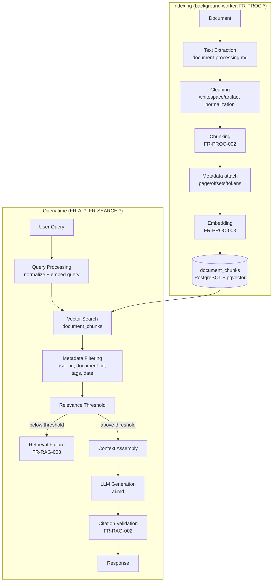

# Doxly — RAG (Retrieval-Augmented Generation) Specification

> Owns the **retrieval mechanics** that power Doxly's AI features: chunking, embedding, vector search, filtering, context assembly, and the citation data model. Workflow-level orchestration of *when* these mechanics are invoked (Retriever node, Context Analyzer node, Citation Validator node) is owned by `specs/langgraph.md` — this file defines what those nodes actually do under the hood. Text extraction (turning a raw file into clean text) is owned by `specs/document-processing.md`. LLM-side prompt/context-budget handling is owned by `specs/ai.md`. Schema is defined in `specs/database.md` (`document_chunks`, `citations`) and must not be contradicted here.

## 1. Pipeline Overview



## 2. Chunking Strategy (`FR-PROC-002`)

- **Method:** recursive, structure-aware splitting — split on paragraph boundaries first, then sentence boundaries, then hard character limits only as a last resort. Never split mid-sentence when a cleaner boundary exists within the target size window.
- **Target size:** 500–800 tokens per chunk. Rationale: large enough to retain coherent context for the LLM to reason over without another chunk, small enough that the top-k retrieved set stays within a reasonable context budget (see `specs/ai.md` §Token Management) and that similarity search stays precise (very large chunks dilute the embedding's topical focus, hurting recall for narrow questions).
- **Overlap:** ~15% (roughly 75–120 tokens) between consecutive chunks, so a fact sitting near a chunk boundary is not orphaned from its surrounding context in both neighboring chunks.
- **PDF page boundaries:** a chunk never silently spans a page break without recording it — if a chunk's content crosses a page boundary, `page_number` records the page the chunk *starts* on, and `char_start`/`char_end` remain relative to the full extracted document text so page attribution stays traceable to `document-processing.md`'s per-page extraction output.
- **CSV structure:** CSV documents are chunked by logical row groups (not raw character windows) — a chunk contains a coherent set of rows (with the header repeated per chunk for context) rather than an arbitrary character slice that could bisect a row.
- **Degenerate inputs:** documents producing near-empty extracted text (e.g., a mostly-image PDF with no text layer) yield zero chunks and the document is routed to `FR-PROC-004`'s failure handling, not force-chunked into meaningless fragments.

## 3. Chunk Metadata

Stored per chunk (exactly matching `database.md`'s `document_chunks` table — no divergence):

| Field | Purpose |
|---|---|
| `document_id`, `chunk_index` | Ordering and uniqueness (`UNIQUE(document_id, chunk_index)`) |
| `page_number` | PDF page attribution for citations |
| `char_start`, `char_end` | Offsets into the full extracted text, for highlighting/traceability |
| `token_count` | Used by Context Assembly (§7) to budget retrieved context precisely rather than estimating |
| `embedding`, `embedding_model` | The vector and which model produced it (supports multi-model coexistence during a provider migration) |

## 4. Embeddings

- **Batching:** chunks for a document are embedded in batches (provider-appropriate batch size, e.g., up to the provider's max batch items/tokens per call) rather than one API call per chunk, to control latency and cost during `FR-PROC-003`.
- **Error handling:** a failed batch is retried with exponential backoff (aligned with `langgraph.md`'s retry principles and `NFR-AVAIL-002`); a batch that still fails after retries fails the whole document's processing (`FR-PROC-004`) rather than leaving it partially embedded and silently marked ready.
- **Re-embedding triggers:** (a) an embedding model upgrade (operator-initiated backfill migration, see `database.md` §4 and §6), (b) a document's source text changing (not supported in MVP — documents are immutable once uploaded; re-upload creates a new document rather than editing an existing one, per `FR-DOC-*` scope).

## 5. Vector Dimensions

Per `decisions.md` ADR-012 / OQ-03: the default embedding provider is OpenAI `text-embedding-3-small`, producing **1536-dimension** vectors, matching `document_chunks.embedding VECTOR(1536)` in `database.md`. This is treated as an **implementation parameter**, not hardcoded product behavior — a future provider swap (e.g., to Voyage AI) requires: (1) a new column or parallel table sized to the new dimension, (2) a backfill job re-embedding existing chunks, (3) a cutover once backfill completes, documented as a migration runbook at implementation time. Product logic (chunking, filtering, citation) is written against "a vector of the configured dimension," never a hardcoded `1536` outside the schema/config layer.

## 6. Similarity Search

Canonical query (identical to `database.md` §4 — repeated here for RAG-context clarity, not redefined):

```sql
SELECT id, content, document_id, page_number,
       1 - (embedding <=> :query_embedding) AS similarity
FROM document_chunks
WHERE user_id = :user_id
  AND (:document_id_filter IS NULL OR document_id = :document_id_filter)
ORDER BY embedding <=> :query_embedding
LIMIT :k;
```

- **Default `k` (top-k):** 8 chunks for single-document Q&A, 12 for multi-document/workspace-wide Q&A (more documents in scope warrants a wider net before trimming in Context Assembly). Tunable per operation via configuration, not hardcoded per call site.
- **Relevance threshold:** results with `similarity` below a configured floor (default: 0.75 on the provider's cosine similarity scale, calibrated during implementation against real query/document pairs) are discarded before reaching Context Assembly. If **zero** chunks clear the threshold, retrieval is a failure (§9), not a low-quality success.
- **Distance operator:** `<=>` (cosine distance) matches the HNSW index's `vector_cosine_ops` operator class defined in `database.md`, so the index is actually used — an accidental switch to `<->` (L2) or `<#>` (inner product) would silently degrade this to a sequential scan or return badly-ranked results, so this is called out explicitly as a correctness requirement, not a style choice.

## 7. Metadata Filtering

Filters are applied in this order of precedence:

1. **`user_id`** — always present, never optional, never derived from client input (`NFR-SEC-001`). This is non-negotiable and applies identically whether the caller is Document Q&A, workspace-wide chat, or global search.
2. **`document_id`** (single-document chat, `FR-AI-001`) or **`document_id IN (...)`** (multi-document chat, `FR-AI-002`) — scopes the candidate set to the conversation's `conversation_documents` rows.
3. **Tag / date-range filters** (`FR-SEARCH-002`) — applied only in the Global Search path, not in chat, since chat scope is defined by document selection rather than tags.
4. **`status = 'ready'`** (implicit, enforced at the repository layer) — chunks only exist for documents that reached `ready`, but the filter guards against a race where a document is mid-reprocessing.

## 8. Context Assembly

Given the filtered, threshold-passing chunk set (already ranked by similarity):

1. **Deduplicate** near-identical chunks (can occur with overlapping chunks both scoring highly) by collapsing chunks with >90% content overlap, keeping the higher-scoring one.
2. **Order** for the prompt: highest relevance first, unless the operation benefits from document-order presentation (e.g., summarization-adjacent Q&A) — MVP default is relevance-order.
3. **Trim to budget**: sum `token_count` across the ordered chunk list and stop including chunks once the retrieval-side token budget (a configured ceiling, e.g., 3000 tokens of retrieved context, distinct from and smaller than the model's full context window) is reached. This budget is a RAG-layer concern — it hands a bounded, ranked context block to `specs/ai.md`'s prompt assembly, which then applies its own overall token management across system prompt + conversation history + this retrieved block.
4. **Attach provenance** to each included chunk (document title, page number) so the Answer Generator node (`langgraph.md`) can produce citations without a second lookup.

## 9. Citation Model

Matches `database.md`'s `citations` table exactly:

| Field | Meaning |
|---|---|
| `document_chunk_id` | The specific chunk the claim is grounded in (nullable — set null if the source chunk is later deleted, per `ON DELETE SET NULL`, so historical citations don't vanish) |
| `document_id` | Always present, for display even if the chunk reference is gone |
| `page_number` | Copied from the chunk at citation-creation time |
| `snippet` | The specific text span supporting the claim (not the full chunk — a focused excerpt) |
| `relevance_score` | The similarity score at retrieval time, for downstream quality auditing |

**Rule (`FR-RAG-002`):** every factual claim in a grounded answer must map to at least one citation. This is enforced by the Citation Validator node (`langgraph.md`) which checks generated claims against the assembled context block — a claim it cannot map to a retrieved chunk is either removed from the response or the response is regenerated with a stricter grounding instruction, never delivered uncited.

## 10. Retrieval Failure Handling (`FR-RAG-003`)

When no chunk clears the relevance threshold (§6):

- The graph does **not** fall through to ungrounded LLM generation.
- The response explicitly states the available documents don't contain information relevant to the question (`FR-AI-004`).
- This is a **success path for the system** (correct behavior), not an error — logged as `ai_requests.status = 'success'` with a flag indicating zero-context response, distinct from a provider/timeout failure.

## 11. Hallucination Prevention — Retrieval-Side Half

(LLM-side mitigation — prompt instructions, generation constraints — lives in `specs/ai.md`.) The retrieval layer's contribution:

- Strict grounding: the LLM is only ever given the assembled, threshold-passing context block — never instructed to "use your general knowledge" as a fallback for document Q&A.
- Snippet-level citation requirement makes fabrication structurally harder to hide (a fabricated claim has no matching snippet to cite).
- Threshold-based rejection (§6) prevents weak/tangential matches from being presented as if they were authoritative.

## 12. Hybrid Search (Recommended for Global Search, `FR-SEARCH-003`)

- Global search (`FR-SEARCH-001`) combines **vector similarity** (semantic recall) with **PostgreSQL full-text search** (exact-term precision) via a generated `tsvector` column on `document_chunks.content` (and on `documents.file_name` for filename matches), GIN-indexed.
- **Fusion method:** reciprocal rank fusion (RRF) — each result's final rank is `1/(k + rank_vector) + 1/(k + rank_fulltext)` (k a small constant, e.g., 60), combining both rankings without needing to normalize incompatible score scales.
- **Document Q&A** (in-document or multi-document chat) uses **vector-only** retrieval for MVP — the corpus is already narrowly scoped by document selection, so full-text's main value (surfacing exact-term matches across a large, topically diverse corpus) is less impactful there. Hybrid search is reserved for Global Search where the corpus is the user's entire document library.

## 13. Reranking (Post-MVP)

Not implemented for MVP. A future enhancement: a cross-encoder reranking pass over the top-N (e.g., top 20) vector-search candidates before applying the relevance threshold and trimming to top-k, to improve precision on ambiguous queries. Flagged in `specs/roadmap.md` as a Post-MVP quality improvement, not a blocker for the core Upload→Ask loop.

## 14. Traceability

| Requirement | Section |
|---|---|
| FR-RAG-001 | §6, §7 |
| FR-RAG-002 | §9 |
| FR-RAG-003 | §10 |
| FR-SEARCH-001, FR-SEARCH-003 | §12 |
| FR-SEARCH-002 | §7 |
| FR-AI-002 | §7 |
| FR-AI-004 | §10, §11 |
| FR-PROC-002 | §2 |
| NFR-SEC-001 | §7 |
| NFR-PERF-005 | §6 (index/query design) |
