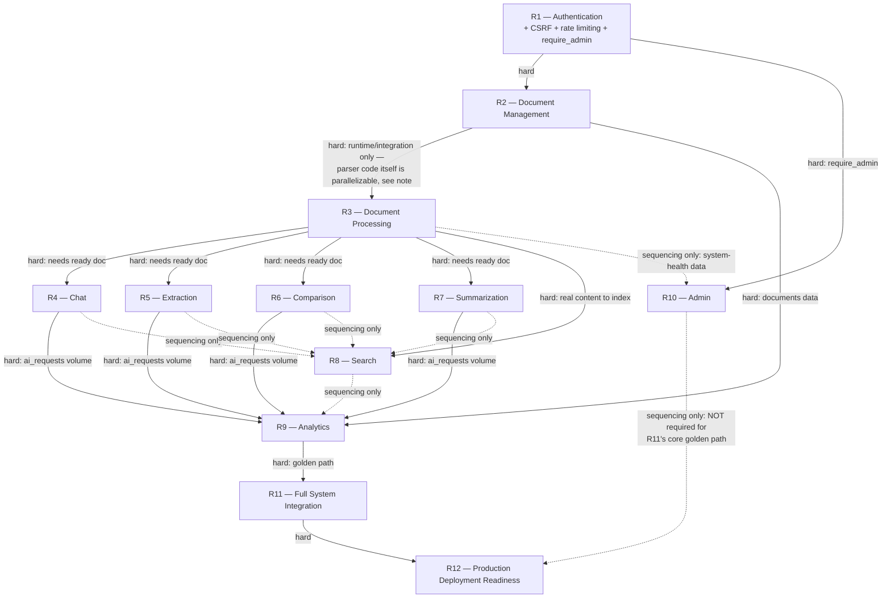

# Doxly — Backend Remediation Plan

> **Status of this document: PLAN ONLY.** No application code has been written, no router/service/migration created, and no spec file (including `roadmap.md`) has been edited as part of producing or updating this plan — §14 lists proposed spec changes for review, not applied changes. This is **Revision 2**, incorporating every required change from the plan-validation pass (verdict: APPROVED WITH CHANGES, 10 required changes, all applied below — see §15 Changelog). It does not replace `specs/roadmap.md`; it sits between the roadmap's original phase numbering and the individual task files (`tasks/R*-*.md`) created, one at a time, per `tasks/README.md`'s existing workflow, when each remediation item is actually started.

## 1. Purpose

The read-only API Router Gap Audit confirmed `backend/app/main.py` exposes only `/health` — zero `APIRouter`s exist anywhere, despite Phases 2, 4, 5, 9, 11, 12, 13, and 14 being marked complete in commit history. Revision 1 of this plan (R1–R10) was itself then validated against the repository and specs; that validation surfaced two pieces of cross-cutting security infrastructure (CSRF, rate limiting) silently assumed rather than planned, one P0 requirement domain (Summarization) entirely missing, and several smaller precision gaps. **This revision folds in every one of those corrections** rather than leaving them as follow-up notes. Twelve remediation tasks now exist, in dependency order, each still grounded in exact requirement IDs, endpoint contracts, and test categories the specs already define — nothing invented.

## 2. Task Structure (Revision 2 — final numbering)

| ID | Name | Status vs. Revision 1 |
|---|---|---|
| R1 | Authentication | **Expanded** — now includes CSRF, rate limiting, `require_admin` |
| R2 | Document Management | **Expanded** — `FR-USER-002` cascade note, status SSE stream |
| R3 | Document Processing | Unchanged |
| R4 | Chat Integration | **Expanded** — full SSE contract, `ai_requests` observability |
| R5 | Extraction Integration | **Expanded** — `ai_requests` observability |
| R6 | Comparison Integration | **Expanded** — `ai_requests` observability |
| R7 | **Summarization Integration** | **NEW** |
| R8 | Search *(was R7)* | **Expanded** — `database.md` schema-spec update alongside migration |
| R9 | Analytics *(was R8)* | **Expanded** — cross-tenant test requirement |
| R10 | **Admin Integration** | **NEW** |
| R11 | Full System Integration *(was R9)* | **Expanded** — golden path now includes Summarization, P0/P1 split |
| R12 | Production Deployment Readiness *(was R10)* | **Expanded** — explicit gate checklist |

## 3. Dependency Graph



**Legend**
- **Solid arrow, "hard":** the downstream task cannot function or be meaningfully tested without the upstream task — a genuine build/runtime precondition.
- **Dashed arrow, "sequencing only":** a practical ordering choice (richer test data, less rework), not a technical blocker — the downstream task's own code has no dependency on the upstream task existing first.

**Notes preserved and sharpened from the validation pass:**
- **R2 → R3 is not uniformly hard.** The *runtime* dependency (a `queued` `documents` row must exist before a worker has anything to process) is hard. The *build* dependency is not: `pdf_parser.py`/`docx_parser.py`/`txt_parser.py`/`csv_parser.py` and the worker skeleton itself have zero code dependency on R2's router/service and can be implemented and unit-tested (against fixture bytes, not a live upload) in parallel with R2. Only final integration (worker actually consuming a real R2-created row) is sequenced after R2.
- **R4/R5/R6/R7 → R8 (Search) is sequencing only**, exactly as the validation confirmed: Search's real dependency is R3 (real document content to index), not the AI domains. Landing R4–R7 first only makes Search's relevance more testable against a realistic corpus.
- **R8 → R9 (Analytics) is sequencing only** for the same reason — Analytics's real dependencies are R2 (documents) and R4/R5/R6/R7 (`ai_requests` volume), which the diagram now shows as direct hard edges instead of the earlier plan's indirect chain through Search.
- **R10 (Admin) explicitly does not feed R11.** Per this revision's explicit instruction: Admin must not block the core P0 golden path. It is required before an "all P1 requirements are production-ready" claim (feeding into R12's gate as a tracked-separately item), but R11's integration test does not include it.

## 4. R1 — Authentication

**Requirement IDs:** `FR-AUTH-001` through `FR-AUTH-008`, `FR-USER-001`/`FR-USER-003`. `FR-USER-002` (account deletion) is owned by R2 — see R2's cascade note in §5.

**Current state:** `User`/`RefreshToken` models and `user_repository.py` exist (schema only). No password hashing, JWT issuance, OAuth, CSRF, rate limiting, or `require_admin` exist anywhere in the codebase (all verified absent by direct inspection, not assumed).

**Endpoints to implement** (`api.md` §1–2): `POST /auth/register`, `POST /auth/verify-email`, `POST /auth/verify-email/resend`, `GET /auth/oauth/google`, `GET /auth/oauth/google/callback`, `POST /auth/login`, `POST /auth/refresh`, `POST /auth/logout`, `POST /auth/password-reset/request`, `POST /auth/password-reset/confirm`, `GET /auth/sessions`, `DELETE /auth/sessions/{session_id}`, `GET /users/me`, `PATCH /users/me`, `GET /users/me/usage`.

**Files to create (planned, per `skills/backend.md` §15):**
- `backend/app/core/security.py` — argon2 password hashing, JWT issuance/verification, Authlib Google OAuth.
- `backend/app/core/dependencies.py` — `get_current_user`, `get_db_session`, **and `require_admin`** (see §4.3).
- `backend/app/core/rate_limit.py` — **new file, added this revision** — the Redis token-bucket dependency (see §4.2).
- `backend/app/core/csrf.py` — **new file, added this revision** — CSRF issuance/verification dependency (see §4.1).
- `backend/app/schemas/auth.py`, `backend/app/schemas/user.py`.
- `backend/app/services/auth_service.py` — registration, login, refresh rotation, logout/revocation, password reset (incl. "revoke ALL refresh tokens"), OAuth linking.
- `backend/app/api/v1/routers/auth.py`, `backend/app/api/v1/routers/users.py`.
- `backend/app/main.py` — `include_router` both, plus mount the CSRF and rate-limit dependencies globally (or per-router — see §4.1/§4.2 for exact application scope).

### 4.1 CSRF double-submit protection (`NFR-SEC-010`, `security.md` §6.3) — new this revision

**This is not auth-only.** `security.md` §6.3 requires CSRF verification "before processing any `POST`/`PUT`/`PATCH`/`DELETE`" **system-wide** — every mutating endpoint built in R2 through R10 depends on this middleware existing, not just `/auth/*`.

**What already exists (frontend, verified by direct inspection, zero changes needed):**
- `frontend/lib/api/client.ts` already reads a `csrf_token` cookie and sends it as an `X-CSRF-Token` header on every `POST`/`PATCH`/`PUT`/`DELETE` request — its own comment states this is "No-op until a backend actually sets that cookie."
- `frontend/app/api/v1/[...path]/route.ts` (the BFF proxy) already forwards the `cookie` header and the `x-csrf-token` header in the request direction, and relays `Set-Cookie` unmodified in the response direction — confirmed by reading the file directly.
- **Precise division of responsibility, resolved during this revision:** `security.md` §6.3's phrase "the Next.js BFF issues a CSRF token" describes the *browser-observed* effect of this relay, not new BFF code. The route handler's own top-of-file comment states it "must never grow business logic" — consistent with that, **FastAPI is the actual origin of the `csrf_token` cookie value**, set via `Set-Cookie` alongside the `access_token`/`refresh_token` cookies at login/register/OAuth-callback success. The BFF needs zero new code; it already relays both directions transparently.

**What R1 must build:**
- Cookie issuance: `auth_service.py`'s login/register/OAuth-success paths set a `csrf_token` cookie — **readable (non-httpOnly, unlike the session cookies), Secure, SameSite=Lax** — alongside the existing session cookies.
- Verification dependency (`core/csrf.py`): a FastAPI dependency injected on every router that defines a `POST`/`PUT`/`PATCH`/`DELETE` route (R1's own `auth`/`users` routers plus every router R2–R10 build), comparing the `X-CSRF-Token` header against the `csrf_token` cookie value on the incoming request. A mismatch or missing token on a mutating request is rejected (`403 csrf_mismatch`, per `api.md` §0.5's error envelope) **before** the route's own business logic runs.
- **Application scope, explicit per this revision's instruction:** applied to `POST`, `PUT`, `PATCH`, `DELETE` on every router — `auth`, `users`, `documents`, `tags`, `chat`, `extractions`, `comparisons`, `summaries`, `search` (has none — `GET`-only), `analytics` (has none — `GET`-only), `admin`. **Not** applied to the small set of endpoints `api.md` §0.3 already exempts from the access-token requirement (`register`, `login`, `refresh`, OAuth start/callback, password-reset request/confirm, `verify-email`) — these are pre-session and have no `csrf_token` cookie yet to check; they rely on `SameSite=Lax` alone (§6.3's first defense layer) plus their own rate-limit/enumeration protections.
- **Acceptance criteria (new):**
  - Given a valid session, when a mutating request is sent with a matching `X-CSRF-Token` header and `csrf_token` cookie, then the request proceeds to its business logic.
  - Given a valid session, when a mutating request is sent with a missing or mismatched `X-CSRF-Token` header, then the request is rejected with `403` before any service/repository code runs.
  - Given a fresh login, then a new `csrf_token` cookie value is issued (not reused from a prior session) — verified by a test asserting two successive logins by the same user produce different `csrf_token` values.

**Tests required:** a dedicated CSRF test suite (new — not previously named in Revision 1): matching-token success, missing-token rejection, mismatched-token rejection, and one test per mutating endpoint added in R1 (register/login are exempt and should be asserted as *not* requiring the header, to catch an over-broad application of the dependency).

### 4.2 Redis rate limiting (`NFR-SEC-002`, `api.md` §0.7) — expanded this revision, no longer login-only

**Mechanism, per `api.md` §0.7 (verbatim, not reinterpreted):** "Two tiers, enforced by Redis token-bucket middleware (`decisions.md` OQ-08, `architecture.md` §2.5)":
- **General API tier:** 60 requests/minute/user, applies to **every** endpoint by default — this is why the dependency belongs in R1's shared infrastructure, not folded into `auth_service.py` as login-specific logic.
- **AI-invoking tier (stricter):** 10 requests/minute/user, plus a daily cap (Free: 30/day, Pro: 500/day). Applies specifically to `POST /chat/conversations/{id}/messages`, `POST /documents/{id}/summaries`, `POST /extractions`, `POST /comparisons`, `POST /documents/{id}/reprocess` — R4/R5/R6/R7/R2 apply this tier's dependency variant to exactly these five routes, each marked "AI rate limit" in `api.md`.
- **Unauthenticated auth endpoints** (`register`, `login`, `password-reset/*`) carry their own **per-IP-and-per-account** limiting on top of the general tier (`NFR-SEC-002`, `security.md` §2.4: 5 failed attempts / 10-minute window per account+IP pair, progressive backoff, never a permanent lockout).

**What R1 must build:**
- `core/rate_limit.py` — a Redis-backed token-bucket dependency, parameterized by tier (general/AI/auth-specific), keyed by `user_id` for authenticated tiers and by the account+IP pair for the pre-session auth tier (per `security.md` §2.4's explicit anti-bypass requirement — an attacker can't rotate IPs against one account or spray many accounts from one IP).
- Applied as a dependency on **every** router built in R1–R10 at the general 60/min tier by default; the five AI-invoking routes additionally get the stricter tier's dependency (R1 builds the shared dependency; R4/R5/R6/R7/R2 each apply it to their one qualifying route — no duplicated rate-limit logic across services, per `CLAUDE.md` §5).
- **Response/status behavior, per `api.md` §0.7 verbatim:** on `429`, a `Retry-After` header (seconds until the bucket next admits a request) and body `{"error":{"code":"rate_limited","message":"..."}}`; daily-cap exhaustion instead returns `{"error":{"code":"daily_ai_limit_exceeded","message":"..."}}` with `Retry-After` set to seconds-until-midnight-UTC.
- **Failure behavior if Redis is unavailable — not specified in any existing spec, flagged here as an open implementation decision for R1, not invented:** neither `security.md` nor `api.md` states whether the API should fail-open (allow the request, log the outage) or fail-closed (reject requests) when the rate-limiter's own Redis connection is down. This must be decided and documented (as a `decisions.md` ADR, per `CLAUDE.md` §4's "major architectural decision" bar — a fail-open choice has real abuse-surface consequences) during R1's implementation, not silently assumed either way by this plan.
- Every login attempt (success or failure) still writes to `audit_logs` per `security.md` §2.4, independent of the rate-limit bucket itself — this was already correctly scoped in Revision 1's `auth_service.py` bullet and is unchanged.

**Tests required:** a dedicated rate-limit test suite (new): general-tier 429 after 60 requests/minute, AI-tier 429 after 10/minute, daily-cap 429 with `daily_ai_limit_exceeded`, auth-tier account+IP throttling (mirrors `testing.md` §3.4's existing brute-force bullet, now explicitly tied to the shared middleware rather than assumed bespoke to auth), and a `Retry-After` header presence/value check.

### 4.3 `require_admin` dependency — new this revision

**Scope, explicit per this revision's instruction: only the reusable dependency is built in R1. The Admin router/service itself is R10's job, not R1's.**

- Added to `core/dependencies.py` alongside `get_current_user`/`get_db_session`, matching `skills/backend.md` §15's folder structure exactly (that file lists all three in the same module — Revision 1 omitted `require_admin` from this list, corrected here).
- **What it verifies:** that the requesting user's `users.role == 'admin'` (`security.md` §3.1's role model — "does the caller's role permit this endpoint at all").
- **How it derives the current user:** composes with `get_current_user` (depends on it, doesn't reimplement JWT verification) — `require_admin` is a thin additional check on top of an already-authenticated request, not a separate auth path.
- **How unauthorized users are rejected:** a non-admin authenticated user gets `403` (role check failure — `api.md` §0.4's explicit "403 is reserved for role checks only, never tenant-ownership checks" convention, correctly distinct from the 404-not-403 pattern used everywhere else in this plan). An unauthenticated request gets `401` (falls through from `get_current_user`, unchanged).
- **How R10 will consume it:** every route in R10's `admin` router (`GET /admin/users`, `GET /admin/system/health`, `POST /admin/users/{id}/suspend`, `POST /admin/users/{id}/unsuspend`) declares `require_admin` as a route dependency — R1's job ends at making that dependency importable and correct; R10 is the first and only consumer.
- **Admin is never a tenant-ownership bypass** (`security.md` §3.1, restated here since it constrains how `require_admin` must be used, not just what it checks): `require_admin` gates *endpoint access*, never substitutes for or bypasses the ownership-scoped repository calls (`TenantScopedRepository`) that every resource-scoped endpoint still uses. `FR-ADMIN-003` (suspend user) touches only `users.status` and cascades a session revocation — it does not, and `require_admin` must not be used to, grant read access to another user's documents/conversations/content through any code path.

**Tests required:** `require_admin` unit test (admin role passes, non-admin role gets 403, unauthenticated gets 401) — built and tested in R1 even though no route consumes it yet; R10 adds the route-level integration tests.

**Key implementation notes (carried from Revision 1, unchanged):** cookies are httpOnly/Secure/SameSite=Lax (except `csrf_token`, which is deliberately readable); `register`/`login`/`refresh` are the only endpoints exempt from the access-token requirement; email verification/password reset need a minimal `EmailProvider` abstraction mirroring the existing `LLMProvider`/`EmbeddingProvider` pattern.

**Tests required (full R1 list):** `testing.md` §3.4 (all 8 `FR-AUTH-*` bullets) + §3.5 (cross-tenant, from `GET /users/me` onward) + the three new suites above (CSRF, rate limiting, `require_admin`).

**Relative size:** Largest single remediation item, now larger still — this revision adds two pieces of shared security infrastructure that Revision 1 under-scoped.

## 5. R2 — Document Management

**Requirement IDs:** `FR-DOC-001` through `FR-DOC-008`. `FR-USER-002` (account deletion) — see cascade note below, **ownership clarified this revision**.

**Current state:** `document_repository.py` + `Document`/`DocumentChunk`/`Tag`/`DocumentTag` models exist (schema + repo methods). No service, no router, no confirmed `StorageProvider` implementation (verify during this task, don't assume one exists).

**Endpoints to implement** (`api.md` §3): `POST /documents/presign`, `POST /documents/{id}/confirm`, `GET /documents`, `GET /documents/{id}`, `GET /documents/{id}/download`, `GET /documents/{id}/content`, `PATCH /documents/{id}`, `DELETE /documents/{id}`, `POST /documents/{id}/reprocess` (AI rate-limit tier, per §4.2), `GET /documents/{id}/status`, **`GET /documents/{id}/status/stream`** (see §5.2, new this revision), `POST /documents/bulk`, `GET /tags`, `POST /tags`, `DELETE /tags/{id}`.

**Files to create (planned):** `backend/app/schemas/document.py`, `backend/app/schemas/tag.py`, `backend/app/services/document_service.py`, `backend/app/api/v1/routers/documents.py`, `backend/app/main.py` (`include_router`). Every mutating route in this router applies R1's CSRF dependency (§4.1) and the general rate-limit tier (§4.2); `reprocess` additionally applies the AI tier.

### 5.1 `FR-USER-002` cross-domain cascade — clarified this revision

**Revision 1 incorrectly implied R2 alone could fully satisfy `FR-USER-002`.** The requirement's own text is explicit: account deletion "hard-deletes all documents, chunks, embeddings, **conversations, extractions**" (and, by the same pattern and `database.md`'s FK structure, comparisons and summaries) "within 30 days." Conversations/extractions/comparisons/summaries belong to R4/R5/R6/R7's tables, not R2's.

**Explicit division of responsibility, to avoid duplicating ownership logic across services (per this revision's instruction):**
- **R2 establishes the deletion *contract*:** the `DELETE /users/me` endpoint (owned by R1's `users` router, not R2's — correcting Revision 1's implicit conflation) performs the immediate soft-delete (`users.deleted_at`, login disabled) and enqueues **one** background purge job for the account, per `privacy.md`'s 30-day retention window.
- **Each domain owns its own hard-delete method, invoked by that one job — not reimplemented per-caller:** `document_repository.py` gets/keeps a `purge_for_user(user_id)`-shaped method (documents + chunks + embeddings + storage); R4/R5/R6/R7, when built, each add the equivalent method to their own repository (`conversation_repository.purge_for_user`, `extraction_repository.purge_for_user`, `comparison_repository.purge_for_user`, `summary_repository.purge_for_user`). The purge job (owned by R2, since it's the account-deletion entrypoint) calls each domain's method — it does not reach into another domain's tables directly, preserving the layering `skills/backend.md` requires.
- **Consequence for sequencing:** R2 can implement and test the *document* half of this cascade immediately. The full `FR-USER-002` acceptance criterion ("a background job purges **all** owned data") is only completely satisfiable once R4/R5/R6/R7 each add their `purge_for_user` method — R2's Definition of Done should state this explicitly rather than claim full completion, the same caveat Revision 1 already correctly applied to `FR-DOC-003`.
- **Acceptance criteria (clarified):** Given a confirmed account-deletion request, when the purge job runs after the retention window, then no row remains in `documents`, `document_chunks`, `conversations`, `messages`, `citations`, `extractions`, `comparisons`, or `document_summaries` for that `user_id` — verified as one integration test once R4–R7 exist, and as a documents-only test in R2 alone until then.

### 5.2 Document status SSE stream — new this revision

**Endpoint:** `GET /documents/{id}/status/stream` (`api.md` §3, alongside the existing polling `GET /documents/{id}/status` — Revision 1 planned only the polling variant).

- **Event behavior:** `text/event-stream`; pushes `event: status` → `data: {"status": "..."}` on every pipeline stage transition (`queued → extracting → chunking → embedding → ready`, or `→ failed`), ending with a terminal `ready`/`failed` event and then closing the stream. Same underlying stage-transition data R3's worker already writes for `FR-PROC-*`/`NFR-OBS-002` — this endpoint is a transport, not a new data source.
- **Connection behavior:** long-lived but bounded — closes automatically once a terminal status is reached (never held open past that point) or on client disconnect.
- **Authentication/authorization:** identical to every other document-scoped endpoint — `get_current_user` + ownership-scoped fetch (`404` if not owned, matching `GET /documents/{id}/status`'s own rule, not a separate code path).
- **Error handling:** a connection to a document that transitions to `failed` still ends with a normal terminal event (`{"status": "failed"}`), not a stream-level error — `failed` is a valid terminal state, not a transport failure.
- **Completion behavior:** frontend falls back to polling `GET .../status` where SSE isn't supported, per `FR-DOC-008`'s "polling or SSE" acceptance criterion (already satisfied by having both — R2 must implement both, not choose one).
- **Testing:** one test asserting the event sequence for a successful pipeline run (`queued`→...→`ready`, stream closes), one for a failure path (`...`→`failed`, stream closes), one for cross-tenant rejection (`404` before any event streams).

**Key implementation notes (carried from Revision 1, unchanged):** presign→confirm upload flow per `deployment.md` §7 (FastAPI never proxies file bytes); MIME-sniffing validation per `NFR-SEC-004`; storage-quota check before any storage write per OQ-07; 404-not-403 cross-tenant behavior via `TenantScopedRepository`; verify which `StorageProvider` implementation actually exists before assuming one.

**Tests required:** `testing.md` §3.3 for every endpoint, §3.5 cross-tenant suite (documents/tags), quota-exceeded rejection, MIME/size validation, plus §5.2's SSE tests and §5.1's cascade test (documents-only scope until R4–R7 land).

## 6. R3 — Document Processing

*(Unchanged from Revision 1 — validation found no defects here beyond a minor library-citation enrichment, applied below.)*

**Requirement IDs:** `FR-PROC-001` through `FR-PROC-005`.

**Current state:** Only `document_processing/chunking.py` exists (tested). No `DocumentParser` interface, no PDF/DOCX/TXT/CSV implementations, no worker entrypoint, no `rq` dependency — the deepest sub-gap in the audit.

**Files to create (planned):**
- `backend/app/document_processing/base.py` — `DocumentParser` interface.
- `backend/app/document_processing/pdf_parser.py`, `docx_parser.py`, `txt_parser.py`, `csv_parser.py` — implementing `decisions.md` ADR-014's already-decided libraries: `pypdf`/`pdfplumber` (PDF), `python-docx` (DOCX), native decode (TXT), Python `csv` module via pandas for larger files (CSV).
- `backend/app/document_processing/parser_registry.py`.
- `backend/app/services/document_processing_service.py` — parse → chunk (reuses `chunking.py` unmodified) → embed (reuses `embedding_service.py` unmodified) → status transitions, **and writes the pipeline stage-transition log R2 §5.2's SSE stream reads from**.
- `backend/app/workers/__init__.py`, `backend/app/workers/document_processing_worker.py` — the RQ consumer entrypoint `architecture.md` §2.3 and `backend/Dockerfile`'s Phase 18 comments anticipate.
- `backend/pyproject.toml` — add `rq`. `docker-compose.yml` — add a `redis`-backed `worker` service once this entrypoint exists.

**Dependencies:** R2 for the runtime/integration half only — parser implementations are independently parallelizable with R2 (§3's dependency-graph note).

**Tests required:** per-file-type extraction tests (golden samples per MIME type), corrupt-file/failure-path tests, retry/backoff (`NFR-AVAIL-002`).

## 7. R4 — Chat Integration

**Requirement IDs:** `FR-AI-001` through `FR-AI-006`.

**Current state:** `ai/graphs/document_qa.py` (verified: `build_document_qa_graph(llm, retrieval) -> CompiledStateGraph`, `QAState` includes `user_id`, `conversation_id`, `history`, `document_id`/`document_ids`, `citations: list[CitationInput]`, `status`), `services/retrieval_service.py`, `services/citation_service.py`, `conversation_repository.py`, `Conversation`/`Message`/`Citation` models all exist and are tested. No router, no service, no SSE endpoint.

**Endpoints to implement** (`api.md` §4): `POST /chat/conversations`, `GET /chat/conversations`, `GET /chat/conversations/{id}`, `DELETE /chat/conversations/{id}`, `POST /chat/conversations/{id}/messages` (AI rate-limit tier), `POST .../messages/{message_id}/stop`, `POST .../messages/{message_id}/regenerate` (AI rate-limit tier).

**Files to create (planned):** `backend/app/schemas/chat.py`, `backend/app/services/chat_service.py`, `backend/app/api/v1/routers/chat.py`. CSRF (§4.1) and rate-limit (§4.2, AI tier on the two message-sending routes) dependencies applied.

### 7.1 Exact SSE contract — specified this revision, per `api.md` §4 verbatim

`POST /chat/conversations/{id}/messages` and `.../regenerate` both return `Content-Type: text/event-stream`, **not** a single JSON body, with this exact event sequence:
- `event: message_id` → `data: {"message_id": uuid}` — the persisted user-message ID, sent first (on `regenerate`, this echoes the **existing** user message's ID instead of creating a new one — the schema is append-only, no message is edited/superseded in place).
- `event: token` → `data: {"text": "..."}`, repeated per generated token.
- `event: citations` → `data: {"citations": [...]}`, sent once after generation completes.
- `event: done` → `data: {"message_id": uuid}` — the persisted assistant-message ID.
- `event: error` → `data: {"code": "...", "message": "..."}` on mid-stream failure; the stream then closes and any partial assistant output generated so far is **persisted, flagged incomplete**, never discarded.

**Errors returned as standard JSON before the stream opens (not as an SSE event):** `404` conversation not found/owned | `409 document_not_ready` if a referenced document is no longer `ready` (e.g., deleted mid-conversation) | `429` AI rate limit exceeded (§4.2). `stop` returns `404` if `message_id` doesn't belong to the caller/conversation, `409 not_in_progress` if already completed/never streaming. `regenerate` returns `404` if `message_id` isn't an assistant message or has no preceding user message.

**Tests required for the SSE contract specifically (new):** full event-sequence assertion for a successful turn (`message_id` → N×`token` → `citations` → `done`, in that order), a mid-stream failure producing `error` + a persisted incomplete message, `stop` halting an in-flight stream and persisting partial content with `status="stopped"`, `regenerate` echoing the existing user-message ID and appending a new assistant row, and the three documented error statuses (`404`/`409 document_not_ready`/`429`).

### 7.2 AI request observability (`NFR-OBS-001`, **P0**) — new this revision

**Every invocation of `build_document_qa_graph` must write one `ai_requests` row via the existing `observability_repository.py`** (confirmed present, built for exactly this purpose per the original Phase 14 task description) — Revision 1 omitted this from R4's file list entirely, despite `NFR-OBS-001` being P0.

- **Fields, per `observability.md` §4 (existing spec, not invented here):** `operation="chat"`, `provider`, `model`, `input_tokens`, `output_tokens`, `latency_ms`, `status` (`success`/`error`/`timeout`), `error_code`, `user_id`.
- **Success and failure both logged:** a row is written for **every** call, including one that times out or errors before returning any tokens — `observability.md` §4 is explicit this is never silently dropped.
- **Never logged (restating `observability.md` §1, applies here):** prompt text, retrieved context content, or the generated response text — the `ai_requests` row is metadata-only.
- **Where it's written:** `chat_service.py`, immediately after each graph invocation completes (success or exception), before the SSE stream's `done`/`error` event closes — not deferred to a background job, since the metadata is already in hand at that point.
- **Consumed by:** R9 (Analytics)'s "AI requests made" stat, per `FR-ANALYTICS-001`.

**Key implementation notes (carried from Revision 1, unchanged):** `FR-AI-004`'s "graceful I don't know" and `FR-RAG-003`'s relevance-threshold rejection already live inside `document_qa.py`'s graph logic — verify, don't reimplement. `FR-AI-002` (multi-document chat) needs `conversation_documents` join-row creation — extend `conversation_repository.py`, don't duplicate. Streaming must not block the FastAPI event loop (`deployment.md` §13's documented exception to the "enqueue everything long-running" rule).

**Dependencies:** R3 (needs a `ready` document).

**Tests required:** `testing.md` §4.1–4.3 (graph-level, already exist) + §3.3 API/integration tests + §3.5 cross-tenant (chat/retrieval, verified "before retrieval runs, not only at the HTTP routing layer") + §7.1's SSE-contract suite + an `ai_requests`-row-written assertion (success and failure paths) per §7.2.

## 8. R5 — Extraction Integration

**Requirement IDs:** `FR-EXT-001` through `FR-EXT-004`.

**Current state:** `ai/graphs/extraction.py` (`build_extraction_graph(...) -> CompiledStateGraph`, `ExtractionState` TypedDict — verified same shape as `document_qa.py`), `extraction_repository.py`, `Extraction` model exist and are tested. No router/service.

**Endpoints to implement** (`api.md` §6): `GET /extractions/templates`, `POST /extractions` (AI rate-limit tier), `GET /extractions/{id}`, `GET /documents/{document_id}/extractions`, `PATCH /extractions/{id}`.

**Files to create (planned):** `backend/app/schemas/extraction.py`, `backend/app/services/extraction_service.py`, `backend/app/api/v1/routers/extractions.py`. CSRF + rate-limit dependencies applied (AI tier on `POST /extractions`).

**AI request observability (new this revision, same pattern as §7.2):** every `build_extraction_graph` invocation writes one `ai_requests` row (`operation="extraction"`) via `observability_repository.py`, success and failure, in `extraction_service.py`.

**Key implementation notes (unchanged):** preset templates (`FR-EXT-002`: invoice/contract/resume/research-paper); schema validation before persisting (`FR-EXT-003` — rejection/retry, never pass-through, verify the graph's own validation node rather than reimplementing); field-edit persistence (`FR-EXT-004`).

**Dependencies:** R3.

**Tests required:** `testing.md` §4.4 (graph-level, exist) + §3.3 API tests + schema-validation-rejection test + `ai_requests`-row assertion.

## 9. R6 — Comparison Integration

**Requirement IDs:** `FR-COMP-001` through `FR-COMP-003`.

**Current state:** `ai/graphs/comparison.py` (`build_comparison_graph(...) -> CompiledStateGraph`, `ComparisonState` — same verified shape), `comparison_repository.py`, `Comparison` model exist and are tested. No router/service.

**Endpoints to implement** (`api.md` §7): `POST /comparisons` (AI rate-limit tier), `GET /comparisons/{id}`, `GET /comparisons`.

**Files to create (planned):** `backend/app/schemas/comparison.py`, `backend/app/services/comparison_service.py`, `backend/app/api/v1/routers/comparisons.py`. CSRF + rate-limit dependencies applied.

**AI request observability (new this revision):** every `build_comparison_graph` invocation writes one `ai_requests` row (`operation="comparison"`), success and failure, in `comparison_service.py`.

**Key implementation notes (unchanged):** two-object tenant check (both documents must belong to the requesting user — a dedicated test shape, not the single-object pattern R4/R5 use); graceful-degradation messaging for structurally dissimilar documents (`FR-COMP-003`).

**Dependencies:** R3 (both compared documents must be `ready`).

**Tests required:** comparison-specific API/E2E tests + §3.5 two-object cross-tenant variant + `ai_requests`-row assertion.

## 10. R7 — Summarization Integration (NEW)

**Added this revision** per the plan-validation finding: `FR-SUM-001` is **P0**, has the identical "graph exists, repository exists, frontend already expects it, no router/service" shape as R4/R5/R6, and was entirely absent from Revision 1. Its absence would have left a P0 requirement unaccounted for at the point Phase 19 checks "all P0 requirements verified against the live production environment."

**Requirement IDs:** `FR-SUM-001` (**P0**) — generate a document summary at a chosen detail level, persisted, quality-checked. `FR-SUM-002` (P1) — re-generate without silently overwriting prior summaries.

**Current state, verified by direct inspection (not assumed):**
- `backend/app/ai/graphs/summarization.py` exists — a compiled LangGraph workflow including a quality-check node (`_quality_router` routing to `pass`/`retry`/`fail`, bounded retries per `MAX_QUALITY_RETRIES`) — its node tests (`test_graph_summarization.py`) pass.
- `backend/app/repositories/summary_repository.py` and the `Summary`/`document_summaries` model exist.
- `frontend/lib/api/summaries.ts` already calls `POST /documents/{id}/summaries`, `GET /documents/{id}/summaries`, `GET /summaries/{id}` — the frontend fully expects this contract, exactly like R4/R5/R6.
- **What's missing:** router, service, and the integration glue connecting the graph's output to `summary_repository.py` — identical gap shape to R4/R5/R6, not a new kind of problem.

**Endpoints to implement** (`api.md` §5): `POST /documents/{id}/summaries` (AI rate-limit tier, per §4.2 — this route is explicitly named in `api.md` §0.7's AI-tier list), `GET /documents/{id}/summaries`, `GET /summaries/{id}`.

**Files to create (planned):**
- `backend/app/schemas/summary.py`.
- `backend/app/services/summary_service.py` — the same router→service→existing-graph→existing-repository pattern R4 established: create/validate the target `ready` document belongs to the caller, invoke the compiled summarization graph with the requested detail level, persist the result via `summary_repository.py` **without overwriting a prior summary** (`FR-SUM-002` — each request creates a new `document_summaries` row, never an update-in-place; the summary list endpoint returns all of them, newest first).
- `backend/app/api/v1/routers/summaries.py`.
- `backend/app/main.py` — `include_router`.

**Authorization / multi-tenancy:** identical single-object ownership pattern to R4/R5 (`document_id` must belong to the caller, `404` otherwise) — no new pattern needed, reuses `TenantScopedRepository`.

**Error handling:** the graph's own quality-check node already bounds retries and produces a `status="failed"` terminal state with a user-safe reason (`langgraph.md` §3, per the Phase 8 implementation's own docstring — "exceeding the retry budget routes to terminal failure with a user-safe reason, `NFR-SEC-009`") — `summary_service.py`'s job is to persist whichever terminal state the graph reaches, not to reimplement the retry/quality logic.

**AI request observability (`NFR-OBS-001`, P0):** every `build_summarization_graph` invocation writes one `ai_requests` row (`operation="summarization"`), success and failure, in `summary_service.py` — same pattern as §7.2/§8/§9, applied here for consistency across all four AI-invoking domains.

**Dependencies:** R3 (needs a `ready` document) — same as R4/R5/R6, hence the same position in the dependency graph (§3).

**Tests required:** graph-level tests already exist (`test_graph_summarization.py`) — this task adds `testing.md` §3.3 API/integration tests, §3.5 cross-tenant test, a quality-check-retry-exhaustion test (asserting the bounded-retry terminal-failure path persists correctly rather than looping), and an `ai_requests`-row assertion.

**Browser/E2E verification:** included in R11's rewritten golden-path E2E suite (§13) — Summarization is now a golden-path step, not a side path.

## 11. R8 — Search *(renumbered from R7)*

**Requirement IDs:** `FR-SEARCH-001` through `FR-SEARCH-003`.

**Current state:** No repository, no service, **no database migration** for `tsvector`/GIN indexing. Only 2 migrations exist total, neither touches full-text search. `document_repository.py`/`retrieval_service.py`'s vector search (built for chat retrieval) is real but conversation-scoped, not the corpus-wide search `FR-SEARCH-001` requires.

**Do NOT implement the migration as part of this plan** — planned here, created when R8 is actively started.

**Endpoints to implement** (`api.md` §8): `GET /search`.

**Files to create (planned):**
- `backend/alembic/versions/xxxx_search_tsvector.py` — generated `tsvector` column + GIN index on `document_chunks`/`documents`.
- `backend/app/repositories/search_repository.py`, `backend/app/schemas/search.py`, `backend/app/services/search_service.py` (reciprocal-rank-fusion combining keyword + vector results, filter application per `FR-SEARCH-002`, ranking, snippet highlighting), `backend/app/api/v1/routers/search.py` (`GET`-only — no CSRF dependency needed, general rate-limit tier applies).

### 11.1 Required schema-specification update — clarified this revision, not just the migration

**Verified during validation:** `specs/database.md`'s own **schema section** does not yet formally define a `tsvector`/`search_vector` column on `documents` or `document_chunks` — only its **traceability table** (a separate part of the file, line ~310) references the need conceptually: "`documents.file_name`/tags (full-text via `tsvector` generated column, see `rag.md` §Hybrid Search)". A migration written against an undocumented column would violate `CLAUDE.md` §4's "spec update and code change belong in the same review" rule.

**This plan does not write that update now** (per this task's own instruction: do not modify `database.md`) — it documents precisely what R8 must add to `database.md`'s schema section (§3, alongside the `documents`/`document_chunks` table definitions) in the same PR as the migration:
- The exact generated column expression (a `GENERATED ALWAYS AS (to_tsvector(...)) STORED` column, or an equivalent trigger-maintained column — R8 picks one and documents the choice as it would any schema decision, per `database.md` §5's migration-authoring conventions).
- Which source fields feed it: `rag.md` §Hybrid Search + the traceability table both point to chunk content plus `documents.file_name`/tag names — R8 confirms the exact field list against `rag.md`'s full Hybrid Search section (not yet re-read in full for this plan; flagged for R8 to verify precisely, not re-derived here).
- The GIN index definition, named consistently with the existing `ix_document_chunks_embedding_hnsw` naming convention already used for the vector index (`database.md` §4).
- A row/entry in `database.md`'s existing table-and-column inventory, not just the traceability table — so a future reader finds the column where every other column is documented, not only implied by cross-reference.

**Key implementation notes (unchanged):** migration verified against the CI ephemeral Postgres for free (Phase 18's `ci.yml` already runs `alembic upgrade head` on every PR) before the repository that depends on it is written.

**Dependencies:** R3 (hard, real content to search over); sequenced after R4–R7 for the practical reason in §3 (dashed edges).

**Tests required:** search relevance sanity tests, §3.5 tenant-isolation test, filter-combination tests.

## 12. R9 — Analytics *(renumbered from R8)*

**Requirement IDs:** `FR-ANALYTICS-001` (**P1**, not P0 — corrected emphasis this revision, see §13's golden-path priority split). `FR-ANALYTICS-002` (P2) remains explicitly deferred.

**Current state:** No repository/service. `observability_repository.py` exists and backs `ai_requests`/`audit_logs` — the plausible aggregation source; verify its actual method coverage during implementation rather than assuming it already supports the needed aggregate queries.

**Endpoints to implement** (`api.md` §9): `GET /analytics/dashboard`.

**Files to create (planned):** `backend/app/schemas/analytics.py`, `backend/app/services/analytics_service.py` (aggregate queries only over what `FR-ANALYTICS-001` names: documents processed over time, storage used, AI requests made, most-used features — no invented metrics), `backend/app/api/v1/routers/analytics.py` (`GET`-only).

### 12.1 Cross-tenant authorization testing — made explicit this revision

**Revision 1 named only "aggregate-query correctness tests" for R9 — insufficient on its own.** An aggregate query is exactly the shape of bug `testing.md` §3.5 exists to catch (e.g., a `COUNT(*)` missing its `WHERE user_id = :user_id` clause, silently including every user's rows). Per `testing.md` §3.5's own authority, this task requires a **dedicated** cross-tenant suite, not folded into general correctness tests:

- **Document counts/storage:** User A's dashboard reflects only User A's `documents` rows — seed User B with additional documents and assert User A's numbers are unaffected.
- **AI request volume:** User A's dashboard reflects only `ai_requests` rows where `user_id = A` — seed User B with chat/extraction/comparison/summarization activity (R4–R7) and assert it never appears in User A's totals.
- **Time-filtered metrics:** the same isolation holds under every supported date-range filter, not just the unfiltered default view.
- **Most-used-features stat:** derived only from User A's own activity across documents/chat/extractions/comparisons/summaries — never aggregated across the full user base.

**Dependencies:** R2 (documents), R4/R5/R6/R7 (AI request volume) — hard; R8 sequenced before only for the practical reason in §3.

**Tests required:** aggregate-query correctness tests + §12.1's dedicated cross-tenant suite.

## 13. R10 — Admin Integration (NEW)

**Added this revision** per the plan-validation finding: `FR-ADMIN-001`/`002`/`003` are all **P1**, have a real, already-built frontend (`frontend/app/(admin)/admin/{page,users,system}.tsx`, `layout.tsx`, guarded by the `AdminGuard` Phase 15 already wired), and were entirely unowned in Revision 1 despite `roadmap.md`'s own P0-requirement cross-reference table already assigning them: "Interleaved with 2/4 (admin views existing data) — hardened in 15."

**Requirement IDs:** `FR-ADMIN-001` (admin user directory), `FR-ADMIN-002` (system health & queue visibility), `FR-ADMIN-003` (suspend/unsuspend a user) — all P1.

**Explicitly does not block the core P0 golden path** (§3's dependency graph, §14's priority split) — it must be complete before an "all P1 requirements are production-ready" claim, tracked separately in R12's gate (§16).

**Current state:** No backend router/service/repository beyond what R1–R9 already provide generically (`user_repository.py`, `observability_repository.py`). No `frontend/lib/api/admin.ts` exists — unlike R1–R9's domains, the frontend pages themselves currently have zero `fetch`/`apiFetch` calls (verified directly), meaning this task's scope includes a first-time frontend API client module, not just a backend gap.

**Endpoints to implement** (`api.md` §12): `GET /admin/users`, `GET /admin/system/health`, `POST /admin/users/{id}/suspend`, `POST /admin/users/{id}/unsuspend`.

**Files to create (planned):**
- `backend/app/schemas/admin.py`.
- `backend/app/services/admin_service.py` — user directory listing (operational metadata only — plan, signup date, status, per `NFR-PRIV-004`/`FR-ADMIN-001`'s explicit "never document content" boundary), system health aggregation (queue depth, failure rates, AI request volume — reusing `observability_repository.py`, the same source R9 uses), suspend/unsuspend (touches only `users.status` + cascades a session revocation via `RefreshToken` — **never** touches that user's documents/conversations/content, per `security.md` §3.1's explicit "admins are not a bypass of ownership checks" rule).
- `backend/app/api/v1/routers/admin.py` — every route declares `require_admin` (R1 §4.3) as a dependency; mutating routes (`suspend`/`unsuspend`) also apply R1's CSRF dependency.
- `frontend/lib/api/admin.ts` — new frontend API client module, matching the existing pattern of every other `lib/api/*.ts` file (`auth.ts`, `documents.ts`, etc.) that this domain currently lacks.
- Wiring the existing `(admin)/admin/*` pages to actually call it (currently static/placeholder, verified by direct inspection).

**Authorization tests (dedicated, per this task's own requirement):** non-admin authenticated user gets `403` on every `/admin/*` route; admin user succeeds; admin role never returns document/chat/extraction content through any admin endpoint (a direct assertion against `FR-ADMIN-001`'s acceptance criterion, not just a route-access check).

**Cross-role tests:** a suspended user's existing session is immediately invalidated (their next request gets `401`, not merely blocked at next login) — `FR-ADMIN-003`'s "immediately revoking all sessions" clause, easy to under-implement as "block future logins only."

**Browser tests:** the existing `frontend/e2e/route-smoke.spec.ts` already has an `/admin/*` test asserting the `AdminGuard`'s rendered state for a non-admin/unauthenticated visitor (Phase 15) — this task extends it to assert the real admin-authenticated success state once the backend exists, plus a non-admin-authenticated-user-sees-403-content test.

**Dependencies:** R1 (`require_admin`) — hard. R3 sequenced before only for meaningful system-health data (dashed, sequencing only, per §3).

## 14. R11 — Full System Integration *(renumbered from R9)*

### 14.1 Golden path — updated this revision to include Summarization, with explicit P0/P1 split

```
Register (P0) → verify email (P1) → Login (P0)
    → Upload document (P0) → Processing reaches `ready` (P0)
    → Open document / viewer (P0)
    → Ask AI question → streamed, cited response persists (P0)
    → Generate a summary (P0 — FR-SUM-001)
    → Run extraction (P0)
    → Compare two documents (P0)
    → Search across documents (P0)
    → View analytics dashboard (P1 — FR-ANALYTICS-001)
```

**Core P0 golden path:** Register → Login → Upload → Process → View → Chat → Summarize → Extract → Compare → Search. This matches `testing.md` §2.4's originally-scoped E2E path (register → upload → chat → extract → compare → search) **plus Summarization**, added because `FR-SUM-001` is P0 and was missing from Revision 1's path — every other step in the original scope was already P0.

**Additional P1 functionality, correctly not gating the core path:** Analytics (`FR-ANALYTICS-001`) — included as the path's final step because it's a natural part of a full user session and Revision 1 already tested it, but its P1 status means R11's integration test should treat a passing Analytics check as expected-and-verified, not as a blocker if it were somehow not yet ready. **Admin (`FR-ADMIN-*`) is not part of this sequential path at all** — it's a separate, admin-only surface (§13), never a step a regular user takes, and is correctly excluded from the golden path entirely rather than downgraded within it.

**Dependencies required for this path to be exercisable end-to-end:** R1 through R9, all complete (R10/Admin explicitly excluded, per §3's dependency graph).

**Automated acceptance tests to define at R11 time (unchanged from Revision 1, now spanning one more domain):**
- A backend integration test suite (`backend/tests/integration/`) driving the entire path above via `httpx.AsyncClient` against real test Postgres/Redis, asserting each stage's persisted state.
- Rewritten Playwright E2E specs (`frontend/e2e/`) asserting the real success path per domain — chat/extractions/compare/search/**summaries** specs currently assert the connectivity-error path (`testing.md` §3's documented interim state) and need rewriting once real endpoints exist.
- The nightly `ai-eval` job backfilled with `testing.md` §4.5/§4.6's actual curated golden-set fixtures, now exercisable against a real chat endpoint end-to-end.

**Browser-based acceptance tests:** a full `claude-in-chrome` pass through the golden path above, once R1–R9 land.

## 15. R12 — Production Deployment Readiness *(renumbered from R10)*

**Explicitly not deployment** — prerequisites only, blocked until R1–R11 are complete (R10/Admin tracked separately, per below).

**Already done (Phase 18/19-prep sessions, inventoried so this doesn't duplicate it):** backend Dockerfile, CI pipeline (`ci.yml`), GHCR registry + deploy-job scaffolding (gated on absent secrets, currently no-ops cleanly), nightly E2E/AI-regression workflow.

**Still to plan/build once R1–R11 land:** `CORS_ALLOWED_ORIGINS`-driven CORS middleware, baseline FastAPI security headers, structured JSON logging + request-ID middleware, `fly.toml`/Railway config pending `decisions.md` OQ-13, a Production Launch Runbook in `deployment.md`, a scripted smoke test, a basic load test against `performance.md`'s existing budgets.

### 15.1 Explicit production gate — specified this revision, per the validation's instruction

**Production cannot be considered complete merely because Docker builds, Vercel builds, environment variables exist, or infrastructure exists.** The gate requires, in full:

**P0 gate (blocks Phase 19 resuming — every item below must be true):**
- [ ] Authentication works (R1: register, login, refresh, logout, password reset, email verification)
- [ ] CSRF protection works (R1 §4.1)
- [ ] Rate limiting works (R1 §4.2)
- [ ] Authorization and multi-tenancy work (R1's `require_admin` + every domain's `TenantScopedRepository` usage, verified by each task's own §3.5 suite)
- [ ] Document upload works (R2)
- [ ] Document processing works (R3)
- [ ] Chat works, including the exact SSE contract (R4 §7.1)
- [ ] Summarization works (R7)
- [ ] Extraction works (R5)
- [ ] Comparison works (R6)
- [ ] Search works (R8)
- [ ] AI request observability works — every AI-invoking domain (R4/R5/R6/R7) writes `ai_requests` rows, success and failure (`NFR-OBS-001`, P0)
- [ ] R11's full backend integration test suite passes
- [ ] R11's rewritten Playwright E2E suite passes (real success paths, not connectivity-error assertions)
- [ ] A production smoke test (§12's own request) covering the P0 golden path (§14.1) passes against the actual deployed environment

**P1, tracked separately — should be done, does not block the initial P0 gate unless a product decision says otherwise:**
- [ ] Analytics (R9, `FR-ANALYTICS-001`)
- [ ] Admin (R10, `FR-ADMIN-001/002/003`)
- [ ] P1 sub-items within P0 domains: email verification (`FR-AUTH-002`), session/device management (`FR-AUTH-008`), rename/tag documents (`FR-DOC-004/006`), preset extraction templates (`FR-EXT-002`), extraction validation/correction (`FR-EXT-003`), re-generate summary (`FR-SUM-002`), filterable/hybrid search (`FR-SEARCH-002/003`)
- [ ] Export (`FR-EXPORT-001`/`004`, P1) — see §16.2, explicitly deferred past R11/R12, ownership not yet assigned to a numbered task

**P2/Post-MVP, explicitly not required for the initial production gate** (per this revision's instruction, and per each requirement's own stated priority): `FR-DOC-007` (bulk actions), `FR-ANALYTICS-002` (document insights), `FR-EXPORT-002/003` (comparison/conversation export), `FR-SETTINGS-001/002` (notification preferences, API keys — the latter explicitly marked "Post-MVP" in `requirements.md` itself).

**Why this section stays otherwise shallow:** most of R12's remaining content (exact env vars that end up mattering, the runbook's precise steps) depends on decisions R1–R11 make during implementation — this revision adds the explicit gate checklist the validation required without over-specifying the parts that genuinely can't be known yet. R12 gets its own detailed task file once R11 is done.

## 16. SDD Reconciliation — Proposed Changes (NOT APPLIED)

Reported for review, not written to any file — `roadmap.md` remains unmodified.

### 16.1 Proposed `specs/roadmap.md` annotations

| Phase | Proposed annotation |
|---|---|
| Phase 2 — Authentication | `**Status: Remediation Required.** Database schema landed; no backend router, service, password hashing, JWT issuance, CSRF protection, or rate limiting exists. See tasks/remediation-plan.md R1.` |
| Phase 4 — Document Management | `**Status: Remediation Required.** Repository/model layer landed; no backend router or service exists. See tasks/remediation-plan.md R2.` |
| Phase 5 — Document Processing | `**Status: Remediation Required.** Chunking landed (Phase 6 overlap); no DocumentParser implementations or worker entrypoint exist. See tasks/remediation-plan.md R3.` |
| Phase 9 — AI Chat | `**Status: Remediation Required.** LangGraph workflow, retrieval, and citation services landed and are unit-tested; no backend router, streaming endpoint, or persistence integration exists. See tasks/remediation-plan.md R4.` |
| **Phase 10 — Summarization** | `**Status: Remediation Required.** LangGraph workflow (including its quality-check node) and repository landed and are unit-tested; no backend router or service exists — identical gap shape to Phases 9/11/12. FR-SUM-001 is P0. See tasks/remediation-plan.md R7.` |
| Phase 11 — Extraction | `**Status: Remediation Required.** LangGraph workflow and repository landed; no backend router or service exists. See tasks/remediation-plan.md R5.` |
| Phase 12 — Comparison | `**Status: Remediation Required.** LangGraph workflow and repository landed; no backend router or service exists. See tasks/remediation-plan.md R6.` |
| Phase 13 — Global Search | `**Status: Remediation Required.** No tsvector/GIN migration, repository, service, or router exist. See tasks/remediation-plan.md R8.` |
| Phase 14 — Analytics | `**Status: Remediation Required.** No repository, service, or router exists. See tasks/remediation-plan.md R9.` |

**Why Phase 10 is added this revision:** the plan-validation pass found `ai/graphs/summarization.py` and `summary_repository.py` exist and are tested, `frontend/lib/api/summaries.ts` already expects the full contract, and no router/service exists — precisely the same evidence pattern that justified every other row in this table. The only reason it wasn't included in Revision 1 is that the original audit request enumerated seven domains and did not name Summarization among them; the validation pass correctly treated that as an omission to surface, not a reason to exclude it. `FR-SUM-001`'s P0 priority makes this consequential, not cosmetic: Phase 19's Definition of Done requires all P0 requirements verified in production, and this requirement would otherwise have gone unverified.

**No annotation proposed for Phase 15 (Security Hardening) despite this revision adding CSRF/rate-limiting/`require_admin` to R1** — those were never Phase 15 deliverables to begin with (Phase 15's own scope, per its roadmap text, is a security *audit/sweep* of what earlier phases built; CSRF/rate-limiting middleware were never built by any earlier phase for Phase 15 to have swept). This is new infrastructure R1 must build, not a regression in previously-complete Phase 15 work.

Phases 1, 3, 6, 7, 8, 15, 16, 17, 18 remain **not** proposed for annotation — unchanged from Revision 1's reasoning.

### 16.2 Export — explicit decision, not silently unowned

- **Requirements:** `FR-EXPORT-001` (P1, summary/extraction export), `FR-EXPORT-004` (P1, full account data export), `FR-EXPORT-002` (P2, comparison export), `FR-EXPORT-003` (P2, conversation export).
- **Current implementation status:** zero, on both frontend and backend — no `/export` reference exists anywhere in `frontend/` (verified directly), unlike every R1–R10 domain, which already has a working frontend client calling the real contract. `roadmap.md`'s P0-only cross-reference table never assigned Export a phase at all, since none of its requirements are P0.
- **Does it block R11?** No — R11's golden path (§14.1) does not include export, matching `testing.md` §2.4's original E2E scope.
- **Does it block Phase 19?** No — Phase 19's Definition of Done is "all **P0** requirements verified"; no `FR-EXPORT-*` requirement is P0.
- **Will it become a future remediation task?** Recommended yes, given `FR-EXPORT-001`/`004` are P1 — but not numbered or sequenced in this revision, consistent with this task's own instruction not to auto-create it. It would depend on R4/R5/R6/R7 (exporting their generated content) once built.
- **Which task/phase owns it:** currently **unowned** — flagged explicitly here as a decision for the next planning pass after R11, not silently dropped.

### 16.3 Settings — explicit decision, not silently unowned

- **Requirements:** `FR-SETTINGS-001` (P2, notification preferences), `FR-SETTINGS-002` (P2, explicitly "Marked P2/Post-MVP" in its own `requirements.md` text).
- **Current implementation status:** a real frontend page exists (`frontend/app/(dashboard)/settings/page.tsx`) with zero `fetch`/`apiFetch` calls found (verified directly) — appears to be a static placeholder, not independently confirmed by a full page read in this plan.
- **Does it block R1–R11?** No.
- **Does it block the core production gate?** No — both requirements are P2, and no other specification elevates their priority.
- **Ownership/deferment:** explicitly deferred past this remediation effort entirely. No future task is proposed for it in this plan; it remains P2/backlog until a product decision (not a technical one) prioritizes it.

### 16.4 No changes proposed to `specs/api.md`, `specs/requirements.md`, `specs/testing.md`, or `README.md`

Unchanged from Revision 1's reasoning — every endpoint contract and requirement ID this plan implements against was already correct; only the implementation was missing. `README.md` was already corrected during the Phase 18 session to state the router gap plainly.

## 17. P0 / P1 / P2 Requirement Ownership Summary

**P0 (blocks Phase 19):** `FR-AUTH-001/003/004/005/006/007` (R1), `FR-USER-001` (R1), `FR-DOC-001/002/003/005/008` (R2), `FR-USER-002` (R2, cross-domain — §5.1), `FR-PROC-001/002/003/004` (R3), `FR-RAG-001/002/003` (already implemented, consumed by R4), `FR-AI-001/003/004` (R4), `FR-SUM-001` (R7), `FR-EXT-001` (R5), `FR-COMP-001/002` (R6), `FR-SEARCH-001` (R8), `NFR-SEC-001` (all tasks' tenant isolation), `NFR-SEC-010`/CSRF (R1), `NFR-SEC-002`/rate limiting (R1), `NFR-OBS-001`/AI observability (R4/R5/R6/R7).

**P1 (tracked separately, does not block initial gate):** `FR-AUTH-002/008`, `FR-USER-003`, `FR-DOC-004/006`, `FR-PROC-005`, `FR-AI-002/005`, `FR-SUM-002`, `FR-EXT-002/003`, `FR-COMP-003` is actually P2 (corrected here — `requirements.md` lists it P2, not P1; carried over verbatim), `FR-SEARCH-002/003`, `FR-ANALYTICS-001` (R9), `FR-EXPORT-001/004` (unowned, §16.2), `FR-ADMIN-001/002/003` (R10).

**P2/Post-MVP (explicitly not required for the initial gate):** `FR-DOC-007`, `FR-COMP-003`, `FR-ANALYTICS-002`, `FR-EXPORT-002/003`, `FR-SETTINGS-001/002` (§16.3), `FR-AI-006` is P2 (regenerate/stop — corrected here; `requirements.md` lists `FR-AI-006` P2, though R4 still implements the `stop`/`regenerate` endpoints since `api.md` specifies them and R4's SSE work covers them at negligible marginal cost — implemented, not gate-blocking).

## 18. Summary

Twelve remediation tasks, in dependency order, four kinds of work: genuinely new implementation (R1's crypto/session/CSRF/rate-limit code, R3's parsers+worker, R8's migration+repository), integration-only work against already-real, already-tested logic (R4/R5/R6/R7, R10's backend half), CRUD-with-real-stakes (R2), and verification (R11)/prerequisites (R12). Every correction the plan-validation pass required has been applied — see §19 for the itemized changelog. No code or spec file (including `roadmap.md`) was modified in producing this revision. Next step, unchanged: create `tasks/R1-authentication.md` when R1 is actively started — not before.

## 19. Changelog (Revision 2)

1. Added §4.1 CSRF double-submit protection to R1, covering issuance, verification, application scope, division of responsibility with the already-built frontend, and acceptance criteria.
2. Added §4.2 Redis rate limiting to R1 as a first-class shared deliverable (both tiers, failure-mode flagged as an open decision, not invented).
3. Added §4.3 `require_admin` to R1's planned `core/dependencies.py`.
4. Added R7 — Summarization Integration as a new, fully-specified task; renumbered Search/Analytics/Integration/Production accordingly.
5. Added `NFR-OBS-001` `ai_requests` observability requirements to R4 (§7.2), R5, R6, and R7.
6. Clarified `FR-USER-002`'s cross-domain cascade in R2 §5.1 (contract vs. per-domain purge methods, no duplicated ownership logic).
7. Added the `GET /documents/{id}/status/stream` SSE endpoint to R2 §5.2.
8. Added the exact Chat SSE event contract and associated error/test requirements to R4 §7.1.
9. Clarified R8 (Search)'s required `database.md` schema-section update alongside its migration (§11.1), without modifying `database.md`.
10. Redrew the dependency graph (§3) with solid/dashed edges and a legend, distinguishing hard from sequencing-only dependencies, including the R2→R3 nuance.
11. Added a dedicated cross-tenant test requirement to R9 (Analytics), §12.1.
12. Added R10 — Admin Integration as a new, fully-specified task, explicitly excluded from R11's core golden path per §3/§14.1.
13. Documented Export's status/priority/non-ownership explicitly (§16.2) rather than leaving it unaddressed.
14. Documented Settings' status/deferment explicitly (§16.3).
15. Added Phase 10 to the proposed `roadmap.md` reconciliation table (§16.1) with reasoning.
16. Updated R11's golden path to include Summarization and explicitly split P0 core path from P1 additional functionality (§14.1).
17. Added an explicit, itemized P0/P1/P2 production gate to R12 (§15.1).
18. Added §17, a consolidated P0/P1/P2 requirement-ownership summary table, and corrected two priority mis-citations found while compiling it (`FR-COMP-003` and `FR-AI-006` are both P2, not P1 — `requirements.md` verified directly).
19. Reviewed the full document for stale R-number references, dependency mentions, and section cross-references; all updated to the final Revision 2 numbering.
